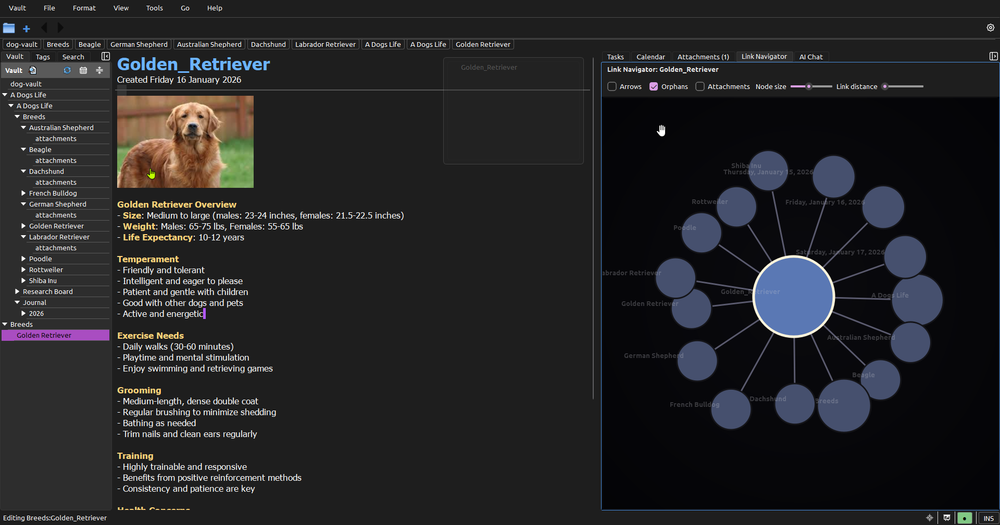
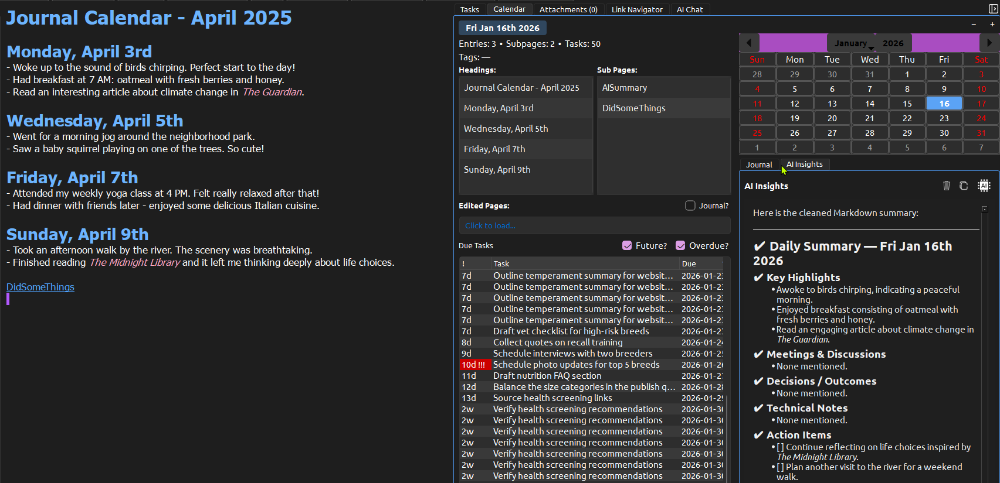
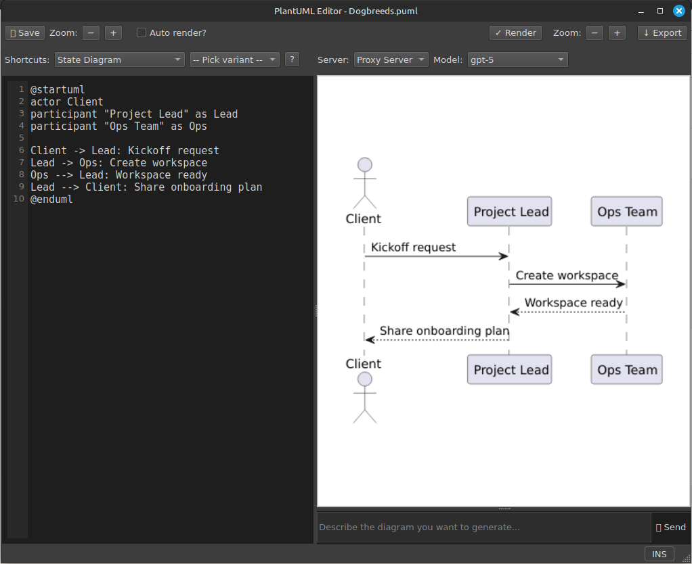
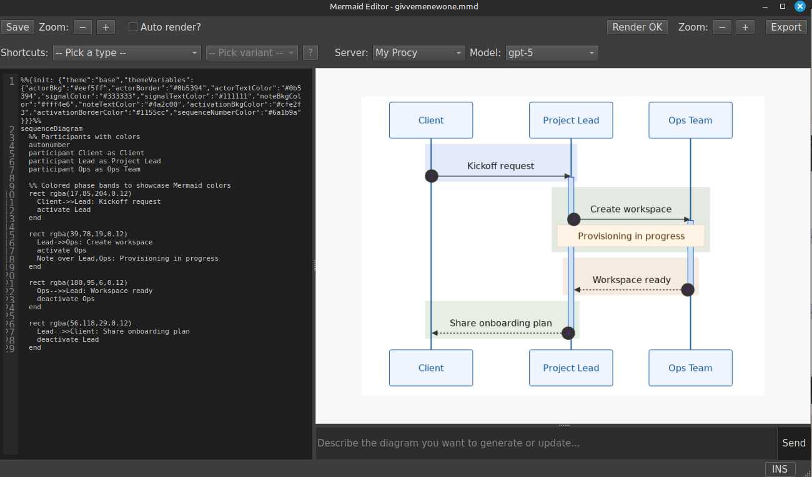
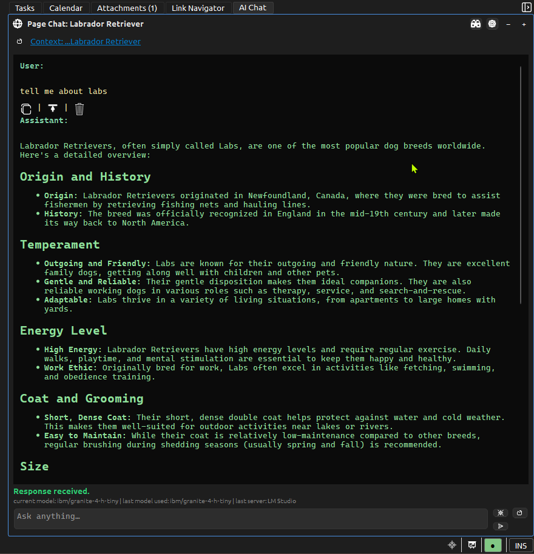

# StillPoint

<p align="center">
  
  </p>

StillPoint is a local-first, markdown note system with a PySide6 desktop app and an embedded FastAPI backend. It is built around a folder-per-page vault structure, fast navigation, and Markdown-first editing.  Local and Remote LLM infused alongside your thoughts and writing where you want it.

## Highlights

- Local-first vaults on disk (folders + Markdown files).



- Fast tree navigation, history popup, and heading switcher.
- Markdown editor with formatting shortcuts, task parsing, inline images, and inline link triggers (`//` quick link, `[[` inline AI prompt).
- Journaling workflows with date navigation and templates.



- Quick Capture (tray/menu/CLI) for low-friction capture into today's page.
- Focus and Audience modes for distraction-free writing and reading.
- Link graph / navigator and filtered navigation for working in a project context.
- Print to browser with clean HTML output, print CSS, and image support.
- Optional vi-mode navigation/editing.
- Built-in help vault and keyboard shortcuts guide.
- PlantUML and Mermaid diagramming with AI-assisted generation and templates.


- Mermaid 

## License

StillPoint is licensed under the Apache License, Version 2.0.
See the [LICENSE](LICENSE) file for details.

## Getting Started

1. Create / activate a virtual environment (optional):
   ```bash
   python -m venv .venv
   source .venv/bin/activate
   ```
2. Install dependencies:
   ```bash
   pip install -r sp/requirements.txt
   ```
3. Run the desktop app:
   ```bash
   python -m sp.app.main
   ```

The embedded FastAPI server boots automatically and listens on `127.0.0.1:${ZIMX_PORT:-8765}`.

## Vault Structure

A vault is a normal folder on disk. Each page is a folder containing a same-named Markdown file:

```
MyVault/
  Projects/
    Project Phoenix/
      Project Phoenix.md
      attachments/
        diagram.png
```

- Page files use `.md` (legacy `.txt` still works).
- Attachments live in `attachments/` alongside the page file.
- Journal pages are stored under `Journal/YYYY/MM/DD/DD.md`.

## Desktop App Overview

The app lives in `sp/app` and is centered around `sp/app/ui/main_window.py` and the custom editor in `sp/app/ui/markdown_editor.py`.

Key UI features:

- Vault picker, New Vault flow, and multi-window support.
- Left tree navigator with inline rename, create, and delete.
- Tree keyboard navigation is selection-first (`Alt+PgUp/PgDn` or arrows), with explicit open on `Enter` (or `Shift+Enter` to keep tree focus).
- Drag and drop to reorder pages within the same folder.
- Right-click "Move To..." to relocate pages or folders to different parents.
- History popup (Ctrl+Tab) and heading switcher (Ctrl+Shift+Tab or Ctrl+Alt+T).
- Task panel with tag filtering and search.
- Calendar panel and "Today" journal actions.
- Attachments, link navigator, and AI panels (optional).
- Inline editor triggers: type `//` to insert a page link, or `[[` to open the inline AI prompt (when AI is enabled).
- Focus/Audience modes for distraction-free reading.
- Page tags use `#tag` and can appear anywhere in a page (task lines are excluded).
- Task tags use `@tag` and stay scoped to tasks.
- Tag picker: type `/# ` in the editor to browse existing page tags and insert one.
- Task tag picker: type `/@ ` on a task line to browse existing task tags and insert one.

## Graph / Project Mode

StillPoint supports project-focused navigation by filtering the vault tree to a chosen root.
This keeps the left nav and related views scoped to the current project area without moving files.

Related features:

- Link graph / navigator for contextual browsing.
- Filtered navigation to work inside a project slice of the vault.

## AI Features

AI features are opt-in and require configuration. Current capabilities include:

- Default server configs ship for local OpenAI-compatible servers (LM Studio on `http://localhost:1234`, plus `http://localhost:8000` and `http://localhost:8080`). These are written into `~/.stillpoint_config.json` only if no servers are configured yet; override or remove them in Preferences → Manage Servers.
- One-shot prompting in-flow (quick refine/transform actions).
- Page chat (contextual chat scoped to the current page).
- Global chat (vault-wide or general context).


- AI actions menu for common edits and transformations.
- Embedded RAG capabilities.
- PDF and .docx extraction with vector indexing (pdfminer, python-docx).
- Image text extraction via Tesseract.

### Sample Use Cases (AI / RAG)

- Ask questions with context from a single page or a series of pages.
- RAG over attachments in a folder (PDFs, Word docs, other text).
- Scrape text from images into the context before querying.

## Keyboard Shortcuts

The built-in help vault includes a full shortcuts guide:

- Help menu: **Help → Keyboard Shortcuts**
- File in repo: `sp/help-vault/Shortcuts/Shortcuts.md`
- Developer notes: [Clipboard Behavior Matrix](docs/clipboard-behavior.md)
- File nav: `Enter` opens and focuses editor; `Shift+Enter` opens and keeps focus in the tree.
- Search results: `Enter` opens and focuses editor; `Shift+Enter` opens and keeps focus in results.
- Tasks and Calendar task lists: `Enter` opens and focuses editor; `Shift+Enter` opens and keeps focus in the list.
- Calendar day grid and Calendar headings/subpages lists: `Enter` opens and focuses editor; `Shift+Enter` opens and keeps focus in Calendar.

The help vault is copied to `~/.stillpoint/help-vault` on first open. On later opens, StillPoint compares the user copy's help-vault version to the embedded version and refreshes the user copy automatically when the embedded help vault is newer.

## FastAPI Backend

The API lives in `sp/server/api.py` and is embedded in the desktop app. It handles vault file access, tree listing, tasks, search, and journal utilities. Requests expect vault-relative paths starting with `/` and are validated to stay within the selected vault root.

### Embedded Server Security

When running the desktop app (`python -m sp.app.main`), the embedded server:
- Automatically generates a secure random password
- Uses it for server admin authentication
- Passes it to the UI automatically
- Runs on localhost (127.0.0.1) with full security enabled

No manual configuration needed for desktop app usage.

### Running as a Standalone Server

You can run StillPoint as a standalone server for multi-user or remote access:

```bash
export SERVER_ADMIN_PASSWORD="your-secure-password-here"
export STILLPOINT_VAULTS_ROOT="/path/to/vaults"
python -m sp.server.api --host 0.0.0.0 --port 8000
```

You can also use the packaged launcher script in [packaging/server/run-server.sh](packaging/server/run-server.sh):

```bash
cd /opt/stillpoint
export SERVER_ADMIN_PASSWORD="your-secure-password-here"
export STILLPOINT_SERVER_HOST="0.0.0.0"
export STILLPOINT_SERVER_PORT="8000"
export STILLPOINT_VAULTS_ROOT="/path/to/vaults"
./packaging/server/run-server.sh
```

To run the packaged server directly with the real executable launcher used by systemd:

```bash
cd /opt/stillpoint
cp .env.example .env
./packaging/server/_launch.sh
```

If you are using the bundled executable, pass `--server` to start the API server:

```bash
export SERVER_ADMIN_PASSWORD="your-secure-password-here"
export STILLPOINT_VAULTS_ROOT="/path/to/vaults"
./stillpoint --server --host 0.0.0.0 --port 8000
```

**Important Security Settings:**

- **`SERVER_ADMIN_PASSWORD`**: Required for standalone servers. Protects vault creation and listing operations. Without this, the server will refuse to start unless you use the `--insecure` flag (NOT RECOMMENDED).
- **`STILLPOINT_VAULTS_ROOT`**: Base directory where all vaults are stored.
- **`STILLPOINT_SERVER_HOST`**: Host interface for the packaged `run-server.sh` launcher (default: `127.0.0.1`).
- **`STILLPOINT_SERVER_PORT`**: Port for the packaged `run-server.sh` launcher (default: `8000`).
- **`STILLPOINT_SERVER_INSECURE`**: Set to `1` to pass `--insecure` through the packaged launcher (NOT RECOMMENDED).
- **`AUTH_ENABLED`**: Set to `false` to disable per-vault authentication (default: `true`).

**Server Security Model:**

1. **Localhost bypass**: Requests from 127.0.0.1/localhost automatically bypass server admin password checks (password still validated on server, just not required from client on same machine)
2. **Server admin password**: Required for vault creation/listing (protects against unauthorized vault operations)
3. **Per-vault authentication**: Each vault has its own username/password set during creation or via `/auth/setup`

### Standalone Server systemd Service

The packaged server includes a systemd unit in [packaging/server/stillpoint-server.service](packaging/server/stillpoint-server.service).

Install it like this:

```bash
cd /opt/stillpoint
cp .env.example .env
sudo cp packaging/server/stillpoint-server.service /etc/systemd/system/
sudo systemctl daemon-reload
sudo systemctl enable --now stillpoint-server.service
sudo systemctl status stillpoint-server.service
sudo journalctl -u stillpoint-server.service -n 50 --no-pager
```

Useful commands:

```bash
sudo systemctl restart stillpoint-server.service
sudo systemctl stop stillpoint-server.service
sudo systemctl disable stillpoint-server.service
sudo journalctl -u stillpoint-server.service -f
```

The service assumes the repo or extracted server bundle lives at `/opt/stillpoint` and reads `/opt/stillpoint/.env` via systemd `EnvironmentFile=` before starting the server launcher in [packaging/server/_launch.sh](packaging/server/_launch.sh).

**Client Setup:**

When adding a remote server in the desktop app:
- For localhost servers (127.0.0.1): Automatically uses embedded server password
- For remote servers: Must enter server admin password with option to remember (stored as SHA256 hash)

### Home Base Retention Janitor

Home Base server storage can be kept lean with the retention janitor in [sp/server/homebase_gc.py](sp/server/homebase_gc.py). It prunes old manifests and checkpoint metadata, then deletes object blobs that are no longer reachable from retained manifests.

The janitor is configured from the server environment:

- `STILLPOINT_VAULTS_ROOT`: Base directory where all vaults are stored.
- `SP_HOMEBASE_GC_KEEP_LATEST`: Always keep the newest N checkpoints.
- `SP_HOMEBASE_GC_KEEP_ALL_DAYS`: Keep all checkpoints newer than this many days.
- `SP_HOMEBASE_GC_KEEP_DAILY_DAYS`: After the full-history window, keep one checkpoint per day for this many days.
- `SP_HOMEBASE_GC_KEEP_WEEKLY_DAYS`: After the daily window, keep one checkpoint per ISO week for this many days.
- `SP_HOMEBASE_GC_MIN_CHECKPOINTS`: Never retain fewer than this many checkpoints per vault.
- `SP_HOMEBASE_GC_DRY_RUN`: When `1`, log deletions without removing files.
- `SP_HOMEBASE_GC_FORCE`: When `1`, bypass the interval gate for the current run.
- `SP_HOMEBASE_GC_INTERVAL_SECONDS`: Minimum time between janitor runs.

When you build the packaged server bundle, the janitor runs from the same `stillpoint-server` executable via `--run-gc`.

You can run it manually with the bundled executable, the packaged launcher, or the Python entrypoint:

```bash
cd /opt/stillpoint
cp .env.example .env
./stillpoint-server --run-gc --help
./stillpoint-server --run-gc --dry-run --force
./stillpoint-server --run-gc --force

./packaging/server/run-homebase-gc.sh --help
./packaging/server/run-homebase-gc.sh --dry-run --force
./packaging/server/run-homebase-gc.sh --force

/opt/stillpoint/venv/bin/python -m sp.server.api --run-gc --help
/opt/stillpoint/venv/bin/python -m sp.server.api --run-gc --dry-run --force
/opt/stillpoint/venv/bin/python -m sp.server.api --run-gc --force
```

Current CLI options for the janitor:

- `--dry-run`: Log what would be deleted without removing any files.
- `--force`: Run immediately and bypass the interval gate for this invocation.

To install it as a systemd timer on the server:

```bash
cd /opt/stillpoint
cp .env.example .env
sudo cp packaging/server/homebase-gc.service /etc/systemd/system/
sudo cp packaging/server/homebase-gc.timer /etc/systemd/system/
sudo systemctl daemon-reload
sudo systemctl enable --now homebase-gc.timer
sudo systemctl start homebase-gc.service
sudo journalctl -u homebase-gc.service -n 50 --no-pager
```

Useful systemd commands:

```bash
sudo systemctl status homebase-gc.timer
sudo systemctl list-timers homebase-gc.timer
sudo systemctl stop homebase-gc.timer
sudo systemctl disable homebase-gc.timer
sudo journalctl -u homebase-gc.service -f
```

The service assumes the repo lives at `/opt/stillpoint` and reads `/opt/stillpoint/.env` via systemd `EnvironmentFile=`. It runs `stillpoint-server --run-gc`. If your install lives elsewhere, adjust `WorkingDirectory`, `ExecStart`, and `EnvironmentFile` in [packaging/server/homebase-gc.service](packaging/server/homebase-gc.service). The shared example env file is [`.env.example`](.env.example).

Sample journal output:

```text
[HomebaseGC] vaults_root=/opt/stillpoint/vaults
[HomebaseGC] retention_policy=keep_latest=50 keep_all_days=7 keep_daily_days=30 keep_weekly_days=90 min_checkpoints=1 dry_run=no interval_s=86400
[HomebaseGC] vault=example-vault size_before=12.43 GB policy=(keep_latest=50 keep_all_days=7 keep_daily_days=30 keep_weekly_days=90 min_checkpoints=1 dry_run=no interval_s=86400) checkpoints=184 retained=63
[HomebaseGC] vault=example-vault deleted_manifests=121 deleted_checkpoints=121 deleted_objects=872 saved=3.18 GB size_after=9.25 GB
[HomebaseGC] vault=example-vault savings_breakdown manifests=14.62 MB checkpoints=38.14 KB objects=3.16 GB
[HomebaseGC] vault=example-vault deleted=/opt/stillpoint/vaults/homebase/example-vault/manifests/ab/abcdef...
[HomebaseGC] summary vaults=1 total_before=12.43 GB total_after=9.25 GB total_saved=3.18 GB
```

## Print to Browser

StillPoint renders pages (or a merged subtree) to HTML and opens the system browser for print/PDF. This avoids Qt print fidelity issues and makes it easy to produce clean, paginated PDFs.

Benefits:

- Browser-based rendering with print CSS for consistent output.
- Images render inline via the embedded server.
- Optional subtree merge: page + descendants are combined into a single, well-ordered document.
- Clean layout that prints as separate pages for a tidy bundled PDF.

Local overrides:

- If `print.html` or `print.css` exist under `~/.stillpoint/templates` or `<vault>/.stillpoint/templates`, StillPoint uses those instead of the defaults.

## Themes

StillPoint uses a JSON-based theming engine:

- Base theme: `sp/app/theme-config.json`.
- Overrides: `~/.stillpoint/themes/<theme>.json`.
- Custom themes are deep-merged over the base theme (only specify the keys you want to change).
- Select themes in Preferences → Appearance → Theme (then refresh the theme list if you add new files).

## Templates

Template files live in `sp/templates` and user templates are stored under `~/.stillpoint/templates`. Templates currently use `.txt` names (by design).

Templates are used for:

- New page creation
- Journal/day pages
- Quick Capture destination content
- Creating a whole series of pages/sub-pages (Technical Spec, Class Notes, Research Papers, etc)

## Tests

Tests live in `tests/`:

```bash
pytest tests
```

## Packaging (PyInstaller)

Build scripts and spec live under `packaging/`.

```bash
pyinstaller -y packaging/sp.spec
```

Artifacts land in `dist/stillpoint/`.

Lite Quick Capture build:

```bash
pyinstaller -y packaging/stillpoint-capture.spec
```

## Install into OS
If you want to install fully into the OS there are some helper scripts in packaging/

### Windows
Open powershell

```bash
> .\venv\Scripts\Activate.ps1
> pyinstaller.exe -y .\packaging\sp.spec
> cd .\packaging\win32\
> .\install.ps1
```

Zimx should be installed in menus, etc.

### Linux
```bash
~/code/stillpoint$ cd packaging/linux-desktop/
~/code/stillpoint/packaging/linux-desktop$ sudo ./install-app.sh 
📦 Installing StillPoint...
➡️  Creating install dir: /opt/stillpoint
➡️  Copying files...
➡️  Creating symlink: /usr/local/bin/stillpoint
➡️  Installing icon to /usr/share/icons/stillpoint.png
➡️  Creating desktop entry at /usr/share/applications/stillpoint.desktop

🎉 StillPoint installed successfully!
You can now launch it from: Menu → Accessories → StillPoint
Or run from terminal: stillpoint
```

## Quick Capture Shortcuts

PyInstaller builds include a `stillpoint` executable that also supports Quick Capture via flags.
The same entry point works for overlay capture or text capture via `--text`/stdin, and can target a specific vault/page.

### Linux (Cinnamon)
- Open **System Settings → Keyboard → Shortcuts → Custom Shortcuts**.
- Add a shortcut with the command:
  - `"/path/to/stillpoint/stillpoint" --quick-capture`
- stdin capture:
  - `echo "Idea..." | /path/to/stillpoint/stillpoint --quick-capture`
- specific vault/page:
  - `/path/to/stillpoint/stillpoint --quick-capture --vault /path/to/vault --page :Projects:Ideas --text "Idea..."`
- Assign your preferred key combo.

### Windows
- Find `stillpoint.exe` inside the installed StillPoint folder.
- Create a desktop shortcut with:
  - `"C:\Path\To\stillpoint\stillpoint.exe" --quick-capture`
- Optional stdin capture (PowerShell):
  - `echo "Idea..." | "C:\Path\To\stillpoint\stillpoint.exe" --quick-capture`
- specific vault/page:
  - `"C:\Path\To\stillpoint\stillpoint.exe" --quick-capture --vault "D:\Vaults\MyVault" --page :Projects:Ideas --text "Idea..."`
- Assign a Shortcut key in **Properties**.

### macOS
- Create an Automator “Quick Action” or Shortcut that runs:
  - `/Applications/StillPoint.app/Contents/MacOS/stillpoint --quick-capture`
- stdin capture:
  - `echo "Idea..." | /Applications/StillPoint.app/Contents/MacOS/stillpoint --quick-capture`
- specific vault/page:
  - `/Applications/StillPoint.app/Contents/MacOS/stillpoint --quick-capture --vault /path/to/vault --page :Projects:Ideas --text "Idea..."`
- Assign a keyboard shortcut to that action in **System Settings → Keyboard → Keyboard Shortcuts**.

## Repo Layout

- `sp/app/` - Desktop app (PySide6)
- `sp/server/` - Embedded FastAPI backend
- `sp/help-vault/` - Bundled help vault content
- `sp/templates/` - Default templates
- `tests/` - pytest suite
- `packaging/` - PyInstaller spec and assets

## Notes

StillPoint stores settings per-vault in `.stillpoint/settings.db` (SQLite). Vault contents always live where the user chooses and remain plain files on disk.

## Funding & Support

This project is developed with a long-term, local-first philosophy:
- Your data stays yours
- Offline-first by default
- No telemetry, ads, or data monetization

If you find this project useful and would like to support its continued development and maintenance, you can do so here:

- ❤️ **GitHub Sponsors** (monthly or one-time):  
  https://github.com/sponsors/grnwood

- ☕ **Ko-fi** (one-time support):  
  https://ko-fi.com/grnwood

Support is always optional. The core project remains fully open source and usable without payment.
