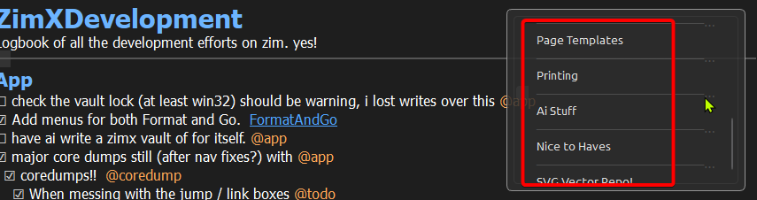

# tocWidget
Created Tuesday 13 January 2026
---
When the toc widget is out of order with heading levels it looks like its putting all the lines at the end of the table of contents.  when the headings are 'properly ordered' it seems to pepper them into the right spots.  How can we fix this?

I don't think the toc widget should require that the document has proper heading levels?  What can we do here?

## level two
---
# level one
---
### level three
---
## level two
---
### level three
---
They look fine on some pages:

I *think* this has to do== when the Hx'heading tags== are 'out of order?'

but on other pages they all get moved to the end?

Not sure about this?  needs research and decision.

### level three

# level one

## level two