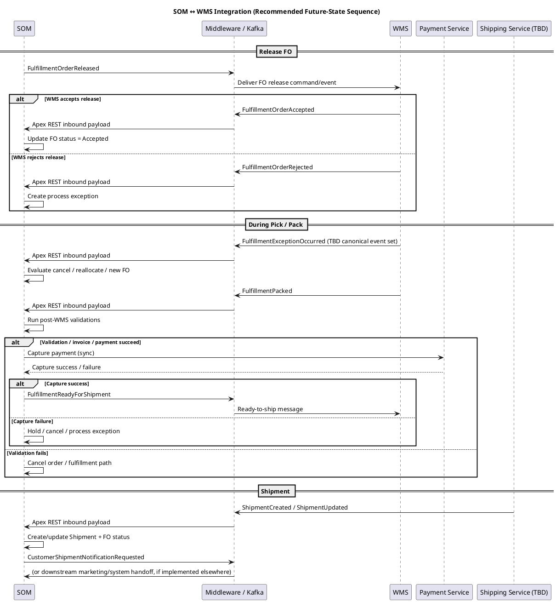

Search returned **168 results for File domains, 109 results for File domains, 360 results for File domains, and 458 results for File domains**; based on the most relevant opened artifacts, here are **all three deliverables** for your **WMS integration spec**:**(1) draft JSON contracts, (2) a PlantUML sequence diagram, and (3) Kafka topic / event naming recommendations**. The internal artifacts consistently reinforce that **SOM owns orchestration and FO status**, **WMS owns physical execution and publishes updates**, and **integration design is still finalizing candidate Kafka topics, failure handling, and sync vs async choices**. [\[#4-Interim...0260703 v1 \| PDF\]](https://capgemininar.sharepoint.com/sites/DigiKey/Shared%20Documents/OMS-Inventory%20Discovery/00%20Project%20Management/05%20Deliverables/#04-L3 Process Flows/01-Submitted/#4-Interim Draft - L3 Process Flows 20260703 v1.pdf?web=1), [\[OMS Discov...0260701 v1 \| PowerPoint\]](https://capgemininar.sharepoint.com/sites/DigiKey/_layouts/15/Doc.aspx?sourcedoc=%7B8805FDB2-E801-4AC0-8779-9F87489DDD07%7D&file=OMS%20Discovery%20-%20Integration%20Core%20Session%2020260701%20v1.pptx&action=edit&mobileredirect=true&DefaultItemOpen=1), [\[#6-Interim...0260703 v1 \| PDF\]](https://capgemininar.sharepoint.com/sites/DigiKey/Shared%20Documents/OMS-Inventory%20Discovery/00%20Project%20Management/05%20Deliverables/#06-Fit-Gap & Remediations/01-Submitted/#6-Interim Draft - Fit-Gap & Remediations 20260703 v1.pdf?web=1)

---

# 3.3 WMS Integration — Deep-Dive Addendum

## 1) What is already grounded vs what is still TBD

### Grounded in your internal material

* The integration design session explicitly says the team still needs to finalize **candidate Kafka topics**, **event producers/consumers**, **sync vs async decisions**, and **failure handling requirements**. [\[OMS Discov...0260701 v1 \| PowerPoint\]](https://capgemininar.sharepoint.com/sites/DigiKey/_layouts/15/Doc.aspx?sourcedoc=%7B8805FDB2-E801-4AC0-8779-9F87489DDD07%7D&file=OMS%20Discovery%20-%20Integration%20Core%20Session%2020260701%20v1.pptx&action=edit&mobileredirect=true&DefaultItemOpen=1)
* The integration material distinguishes **commands/actions** (“please do something”) from **events** (“something already happened”), using examples like **Create Order** vs **Order Created**, and says events should use **business language**, stay **small**, be **versioned**, and publish **facts, not internal states**. [\[OMS Discov...0260701 v1 \| PowerPoint\]](https://capgemininar.sharepoint.com/sites/DigiKey/_layouts/15/Doc.aspx?sourcedoc=%7B8805FDB2-E801-4AC0-8779-9F87489DDD07%7D&file=OMS%20Discovery%20-%20Integration%20Core%20Session%2020260701%20v1.pptx&action=edit&mobileredirect=true&DefaultItemOpen=1)
* The interim fulfillment flow shows **SOM creates FO(s)** and **sends FO(s) to WMS**, while **WMS owns wave, pick, pack, ship execution** and **publishes warehouse updates to SOM**; **SOM owns FO status, invoicing, payment exception handling, and customer communication**. [\[#4-Interim...0260703 v1 \| PDF\]](https://capgemininar.sharepoint.com/sites/DigiKey/Shared%20Documents/OMS-Inventory%20Discovery/00%20Project%20Management/05%20Deliverables/#04-L3 Process Flows/01-Submitted/#4-Interim Draft - L3 Process Flows 20260703 v1.pdf?web=1)
* The same flow shows **Release Accepted/Rejected**, **Fulfillment Exceptions Event**, **Pack Complete Event**, **Validation Checkpoint #4 (Pack Complete)**, **Capture Funds**, and then **Proceed to Ship Tunnel**. [\[#4-Interim...0260703 v1 \| PDF\]](https://capgemininar.sharepoint.com/sites/DigiKey/Shared%20Documents/OMS-Inventory%20Discovery/00%20Project%20Management/05%20Deliverables/#04-L3 Process Flows/01-Submitted/#4-Interim Draft - L3 Process Flows 20260703 v1.pdf?web=1)
* The financial workshop notes state that **WMS sends pack complete**, **payment capture is triggered at pack complete (pre-shipment)**, and **shipment only occurs after successful payment capture**. The same notes also say DigiKey intends to continue using the existing **payment service synchronously**. [\[OMS Discov...s 20260617 \| Word\]](https://capgemininar.sharepoint.com/sites/DigiKey/_layouts/15/Doc.aspx?sourcedoc=%7BC292A68E-BDC4-42CA-9B3B-725101BB25E3%7D&file=OMS%20Discovery%20FS%20-%C2%A0WK13%20Future%20State%20Financial%20Lifecycle%C2%A0Notes%2020260617.docx&action=default&mobileredirect=true&DefaultItemOpen=1)
* The gap log explicitly says the future-state design still lacks: **warehouse exception events**, a **Release Accepted** event from WMS, sufficient **shipment details such as tracking, package information, and line-to-package relationships**, a **future-state shipping integration** for shipment events/tracking, and an **external document generation solution** for customer-facing documents. [\[#6-Interim...0260703 v1 \| PDF\]](https://capgemininar.sharepoint.com/sites/DigiKey/Shared%20Documents/OMS-Inventory%20Discovery/00%20Project%20Management/05%20Deliverables/#06-Fit-Gap & Remediations/01-Submitted/#6-Interim Draft - Fit-Gap & Remediations 20260703 v1.pdf?web=1)

### Still TBD / not finalized

* The exact WMS event set is **not yet defined**. The gap log says the required warehouse exception events are not currently defined. [\[#6-Interim...0260703 v1 \| PDF\]](https://capgemininar.sharepoint.com/sites/DigiKey/Shared%20Documents/OMS-Inventory%20Discovery/00%20Project%20Management/05%20Deliverables/#06-Fit-Gap & Remediations/01-Submitted/#6-Interim Draft - Fit-Gap & Remediations 20260703 v1.pdf?web=1)
* Commercial invoice generation / ownership is still a gap because customer-facing document generation needs an external solution, and OMS also needs a reference to the commercial invoice in the invoice record. [\[#6-Interim...0260703 v1 \| PDF\]](https://capgemininar.sharepoint.com/sites/DigiKey/Shared%20Documents/OMS-Inventory%20Discovery/00%20Project%20Management/05%20Deliverables/#06-Fit-Gap & Remediations/01-Submitted/#6-Interim Draft - Fit-Gap & Remediations 20260703 v1.pdf?web=1)
* Your note that **601 Order Status Change** may be the main warehouse message is currently a **working assumption from your notes**, not something I found explicitly confirmed in the opened internal artifacts.

---

# 2) Recommended WMS JSON contract set (draft)

## Important framing

Everything below is a **recommended draft contract shape**, not a claim that DigiKey or [OMS Discovery - Integration Core Session 20260701 v1.pptx](https://capgemininar.sharepoint.com/sites/DigiKey/_layouts/15/Doc.aspx?sourcedoc=%7B8805FDB2-E801-4AC0-8779-9F87489DDD07%7D\&file=OMS%20Discovery%20-%20Integration%20Core%20Session%2020260701%20v1.pptx\&action=edit\&mobileredirect=true\&EntityRepresentationId=9904e491-27df-4342-a6a0-154f797c537b) already finalized these exact field names. The recommendation is based on the internal guidance to use **canonical business language**, **small versioned events**, and **unique event IDs / correlation IDs**. [\[OMS Discov...0260701 v1 \| PowerPoint\]](https://capgemininar.sharepoint.com/sites/DigiKey/_layouts/15/Doc.aspx?sourcedoc=%7B8805FDB2-E801-4AC0-8779-9F87489DDD07%7D&file=OMS%20Discovery%20-%20Integration%20Core%20Session%2020260701%20v1.pptx&action=edit&mobileredirect=true&DefaultItemOpen=1)

## 2.1 Shared envelope (recommended)

```json
{
  "eventType": "FulfillmentOrderReleased",
  "eventVersion": "1.0",
  "eventId": "uuid",
  "eventTime": "2026-07-11T13:00:00Z",
  "correlationId": "order-or-fo-correlation-id",
  "causationId": "prior-event-id-if-known",
  "sourceSystem": "SOM",
  "targetSystem": "WMS",
  "tenant": "DigiKey",
  "payload": {}
}
```

### Why this is the right shape

* The internal integration session recommends **eventType**, **eventVersion**, **eventId**, **eventTime**, **correlationId**, and business-language payloads without Salesforce or Manhattan field names. [\[OMS Discov...0260701 v1 \| PowerPoint\]](https://capgemininar.sharepoint.com/sites/DigiKey/_layouts/15/Doc.aspx?sourcedoc=%7B8805FDB2-E801-4AC0-8779-9F87489DDD07%7D&file=OMS%20Discovery%20-%20Integration%20Core%20Session%2020260701%20v1.pptx&action=edit&mobileredirect=true&DefaultItemOpen=1)
* This also supports the internal emphasis on **idempotency**, **traceability**, and **fact-based business events**. [\[OMS Discov...0260701 v1 \| PowerPoint\]](https://capgemininar.sharepoint.com/sites/DigiKey/_layouts/15/Doc.aspx?sourcedoc=%7B8805FDB2-E801-4AC0-8779-9F87489DDD07%7D&file=OMS%20Discovery%20-%20Integration%20Core%20Session%2020260701%20v1.pptx&action=edit&mobileredirect=true&DefaultItemOpen=1)

---

## 2.2 SOM → WMS command: Fulfillment Order Release

### Recommended canonical name

`FulfillmentOrderReleased`

### Purpose

This is the handoff from SOM to WMS after allocation / pre-release gating is satisfied and SOM has created the FO(s). The flow explicitly shows **Create SOM FO(s)** and **Send FO(s) to WMS**. [\[#4-Interim...0260703 v1 \| PDF\]](https://capgemininar.sharepoint.com/sites/DigiKey/Shared%20Documents/OMS-Inventory%20Discovery/00%20Project%20Management/05%20Deliverables/#04-L3 Process Flows/01-Submitted/#4-Interim Draft - L3 Process Flows 20260703 v1.pdf?web=1)

```json
{
  "eventType": "FulfillmentOrderReleased",
  "eventVersion": "1.0",
  "eventId": "1a2b3c",
  "eventTime": "2026-07-11T13:00:00Z",
  "correlationId": "ORD-12345",
  "sourceSystem": "SOM",
  "targetSystem": "WMS",
  "payload": {
    "fulfillmentOrderId": "FO-10001",
    "orderId": "ORD-12345",
    "deliveryGroupId": "ODG-10",
    "fulfillmentLocationId": "LOC-CHI-01",
    "shipMethod": "GROUND",
    "shipCompletePreference": "PARTIAL_ALLOWED",
    "lines": [
      {
        "fulfillmentOrderLineId": "FOLI-1",
        "orderLineId": "OIS-1",
        "sku": "ABC-123",
        "quantityToFulfill": 5,
        "uom": "EA"
      }
    ]
  }
}
```

### Recommendation

Treat this as a **command-style business event** even if physically implemented through middleware/Kafka. The internal integration session says commands are “please do something” and events are “something already happened.” Sending work to WMS is architecturally command-like. [\[OMS Discov...0260701 v1 \| PowerPoint\]](https://capgemininar.sharepoint.com/sites/DigiKey/_layouts/15/Doc.aspx?sourcedoc=%7B8805FDB2-E801-4AC0-8779-9F87489DDD07%7D&file=OMS%20Discovery%20-%20Integration%20Core%20Session%2020260701%20v1.pptx&action=edit&mobileredirect=true&DefaultItemOpen=1)

---

## 2.3 WMS → SOM fact: Fulfillment Order Accepted

### Recommended canonical name

`FulfillmentOrderAccepted`

### Why this matters

The gap log explicitly says OMS requires confirmation that a Fulfillment Order has been successfully accepted by WMS and that this event **does not exist today** and must be implemented. [\[#6-Interim...0260703 v1 \| PDF\]](https://capgemininar.sharepoint.com/sites/DigiKey/Shared%20Documents/OMS-Inventory%20Discovery/00%20Project%20Management/05%20Deliverables/#06-Fit-Gap & Remediations/01-Submitted/#6-Interim Draft - Fit-Gap & Remediations 20260703 v1.pdf?web=1)

```json
{
  "eventType": "FulfillmentOrderAccepted",
  "eventVersion": "1.0",
  "eventId": "2b3c4d",
  "eventTime": "2026-07-11T13:00:07Z",
  "correlationId": "ORD-12345",
  "sourceSystem": "WMS",
  "targetSystem": "SOM",
  "payload": {
    "fulfillmentOrderId": "FO-10001",
    "warehouseReferenceId": "DO-998877",
    "acceptedLines": [
      {
        "fulfillmentOrderLineId": "FOLI-1",
        "acceptedQuantity": 5
      }
    ]
  }
}
```

---

## 2.4 WMS → SOM fact: Fulfillment Order Rejected

### Recommended canonical name

`FulfillmentOrderRejected`

### Why this matters

The fulfillment process flow explicitly shows **Release Accepted/Rejected** and **Accept Release? Yes/No**. [\[#4-Interim...0260703 v1 \| PDF\]](https://capgemininar.sharepoint.com/sites/DigiKey/Shared%20Documents/OMS-Inventory%20Discovery/00%20Project%20Management/05%20Deliverables/#04-L3 Process Flows/01-Submitted/#4-Interim Draft - L3 Process Flows 20260703 v1.pdf?web=1)

```json
{
  "eventType": "FulfillmentOrderRejected",
  "eventVersion": "1.0",
  "eventId": "3c4d5e",
  "eventTime": "2026-07-11T13:00:08Z",
  "correlationId": "ORD-12345",
  "sourceSystem": "WMS",
  "targetSystem": "SOM",
  "payload": {
    "fulfillmentOrderId": "FO-10001",
    "rejectionReasonCode": "INVALID_LOCATION",
    "rejectionReasonMessage": "Location could not accept release"
  }
}
```

---

## 2.5 WMS → SOM fact: Fulfillment Exception

### Recommended canonical name

`FulfillmentExceptionOccurred`

### Why this matters

The gap log says warehouse exception events are not yet defined and are required so OMS can decide to **cancel, reallocate, or create a new FO**.
The process flow also shows **Fulfillment Exceptions Event** and then **Cancel or Reallocate?** in SOM. [\[#6-Interim...0260703 v1 \| PDF\]](https://capgemininar.sharepoint.com/sites/DigiKey/Shared%20Documents/OMS-Inventory%20Discovery/00%20Project%20Management/05%20Deliverables/#06-Fit-Gap & Remediations/01-Submitted/#6-Interim Draft - Fit-Gap & Remediations 20260703 v1.pdf?web=1) [\[#4-Interim...0260703 v1 \| PDF\]](https://capgemininar.sharepoint.com/sites/DigiKey/Shared%20Documents/OMS-Inventory%20Discovery/00%20Project%20Management/05%20Deliverables/#04-L3 Process Flows/01-Submitted/#4-Interim Draft - L3 Process Flows 20260703 v1.pdf?web=1)

```json
{
  "eventType": "FulfillmentExceptionOccurred",
  "eventVersion": "1.0",
  "eventId": "4d5e6f",
  "eventTime": "2026-07-11T13:15:00Z",
  "correlationId": "ORD-12345",
  "sourceSystem": "WMS",
  "targetSystem": "SOM",
  "payload": {
    "fulfillmentOrderId": "FO-10001",
    "fulfillmentOrderLineId": "FOLI-1",
    "exceptionType": "SHORT_PICK",
    "reasonCode": "SHORTS",
    "requestedQuantity": 5,
    "affectedQuantity": 2,
    "message": "Unable to locate full quantity during pick"
  }
}
```

### Best-practice recommendation

Model exceptions at the **line level** whenever possible. The internal flows consistently talk about line-specific allocation, reallocation, shorts, and generating new FO(s).
That makes your instinct right: **pack / pick exceptions should generally land at FOLI level**, with FO status derived upward. [\[#4-Interim...0260703 v1 \| PDF\]](https://capgemininar.sharepoint.com/sites/DigiKey/Shared%20Documents/OMS-Inventory%20Discovery/00%20Project%20Management/05%20Deliverables/#04-L3 Process Flows/01-Submitted/#4-Interim Draft - L3 Process Flows 20260703 v1.pdf?web=1), [\[#6-Interim...0260703 v1 \| PDF\]](https://capgemininar.sharepoint.com/sites/DigiKey/Shared%20Documents/OMS-Inventory%20Discovery/00%20Project%20Management/05%20Deliverables/#06-Fit-Gap & Remediations/01-Submitted/#6-Interim Draft - Fit-Gap & Remediations 20260703 v1.pdf?web=1)

---

## 2.6 WMS → SOM fact: Pack Complete

### Recommended canonical name

`FulfillmentPacked`

### Why this matters

The financial lifecycle notes say WMS sends **pack complete**, which then triggers compliance/tax/payment readiness checks and **payment capture before shipment**.
The fulfillment flow shows **Pack Complete Event** leading into **Validation Checkpoint #4 (Pack Complete)** and then **Capture Funds**. [\[OMS Discov...s 20260617 \| Word\]](https://capgemininar.sharepoint.com/sites/DigiKey/_layouts/15/Doc.aspx?sourcedoc=%7BC292A68E-BDC4-42CA-9B3B-725101BB25E3%7D&file=OMS%20Discovery%20FS%20-%C2%A0WK13%20Future%20State%20Financial%20Lifecycle%C2%A0Notes%2020260617.docx&action=default&mobileredirect=true&DefaultItemOpen=1) [\[#4-Interim...0260703 v1 \| PDF\]](https://capgemininar.sharepoint.com/sites/DigiKey/Shared%20Documents/OMS-Inventory%20Discovery/00%20Project%20Management/05%20Deliverables/#04-L3 Process Flows/01-Submitted/#4-Interim Draft - L3 Process Flows 20260703 v1.pdf?web=1)

```json
{
  "eventType": "FulfillmentPacked",
  "eventVersion": "1.0",
  "eventId": "5e6f7g",
  "eventTime": "2026-07-11T13:40:00Z",
  "correlationId": "ORD-12345",
  "sourceSystem": "WMS",
  "targetSystem": "SOM",
  "payload": {
    "fulfillmentOrderId": "FO-10001",
    "packedLines": [
      {
        "fulfillmentOrderLineId": "FOLI-1",
        "packedQuantity": 5
      }
    ],
    "packageCount": 2
  }
}
```

---

## 2.7 SOM → WMS fact/command: Ready to Ship

### Recommended canonical name

`FulfillmentReadyForShipment`

### Why this matters

Your process description says SOM will submit a message back to WMS after **validation, invoice, and payment capture successful**. That direction is strongly supported by the fulfillment flow showing **Validation, Invoice, and Payment Capture Successful?** followed by **Proceed to Ship Tunnel**. [\[#4-Interim...0260703 v1 \| PDF\]](https://capgemininar.sharepoint.com/sites/DigiKey/Shared%20Documents/OMS-Inventory%20Discovery/00%20Project%20Management/05%20Deliverables/#04-L3 Process Flows/01-Submitted/#4-Interim Draft - L3 Process Flows 20260703 v1.pdf?web=1)

```json
{
  "eventType": "FulfillmentReadyForShipment",
  "eventVersion": "1.0",
  "eventId": "6f7g8h",
  "eventTime": "2026-07-11T13:41:00Z",
  "correlationId": "ORD-12345",
  "sourceSystem": "SOM",
  "targetSystem": "WMS",
  "payload": {
    "fulfillmentOrderId": "FO-10001",
    "invoiceId": "INV-777",
    "paymentCaptureStatus": "CAPTURED",
    "validationStatus": "PASSED"
  }
}
```

---

## 2.8 Shipping Service → SOM fact: Shipment Created / Updated

### Recommended canonical name

`ShipmentCreated` or `ShipmentUpdated`

### Why this matters

The gap log says OMS needs **tracking number, package information, and line-to-package relationships**, and the future-state shipping integration is not yet in place.
The fulfillment flow says shipment events should provide **Shipment Status**, **Shipment Tracking Info**, **Only what was shipped**, and **What parts per box**, and it also notes WMS does not currently handle shipment/tracking because ERP does that today. [\[#6-Interim...0260703 v1 \| PDF\]](https://capgemininar.sharepoint.com/sites/DigiKey/Shared%20Documents/OMS-Inventory%20Discovery/00%20Project%20Management/05%20Deliverables/#06-Fit-Gap & Remediations/01-Submitted/#6-Interim Draft - Fit-Gap & Remediations 20260703 v1.pdf?web=1) [\[#4-Interim...0260703 v1 \| PDF\]](https://capgemininar.sharepoint.com/sites/DigiKey/Shared%20Documents/OMS-Inventory%20Discovery/00%20Project%20Management/05%20Deliverables/#04-L3 Process Flows/01-Submitted/#4-Interim Draft - L3 Process Flows 20260703 v1.pdf?web=1)

```json
{
  "eventType": "ShipmentCreated",
  "eventVersion": "1.0",
  "eventId": "7g8h9i",
  "eventTime": "2026-07-11T13:55:00Z",
  "correlationId": "ORD-12345",
  "sourceSystem": "ShippingService",
  "targetSystem": "SOM",
  "payload": {
    "shipmentId": "SHP-9001",
    "fulfillmentOrderId": "FO-10001",
    "shipmentStatus": "SHIPPED",
    "carrierCode": "UPS",
    "trackingNumbers": ["1Z999AA10123456784"],
    "packages": [
      {
        "packageId": "PKG-1",
        "trackingNumber": "1Z999AA10123456784",
        "items": [
          {
            "fulfillmentOrderLineId": "FOLI-1",
            "shippedQuantity": 5
          }
        ]
      }
    ]
  }
}
```

---

# 3) PlantUML sequence diagram — WMS integration

This diagram is a **recommended future-state sequence** built from the internal flow steps that are already visible: FO release, Release Accepted/Rejected, Fulfillment Exceptions, Pack Complete, pack-complete validation/capture, and shipment event publication. [\[#4-Interim...0260703 v1 \| PDF\]](https://capgemininar.sharepoint.com/sites/DigiKey/Shared%20Documents/OMS-Inventory%20Discovery/00%20Project%20Management/05%20Deliverables/#04-L3 Process Flows/01-Submitted/#4-Interim Draft - L3 Process Flows 20260703 v1.pdf?web=1), [\[OMS Discov...s 20260617 \| Word\]](https://capgemininar.sharepoint.com/sites/DigiKey/_layouts/15/Doc.aspx?sourcedoc=%7BC292A68E-BDC4-42CA-9B3B-725101BB25E3%7D&file=OMS%20Discovery%20FS%20-%C2%A0WK13%20Future%20State%20Financial%20Lifecycle%C2%A0Notes%2020260617.docx&action=default&mobileredirect=true&DefaultItemOpen=1), [\[#6-Interim...0260703 v1 \| PDF\]](https://capgemininar.sharepoint.com/sites/DigiKey/Shared%20Documents/OMS-Inventory%20Discovery/00%20Project%20Management/05%20Deliverables/#06-Fit-Gap & Remediations/01-Submitted/#6-Interim Draft - Fit-Gap & Remediations 20260703 v1.pdf?web=1)



---

# 4) Kafka topic design + event naming convention

## Important framing

These are **recommendations**, not already-approved DigiKey topic names. The internal design session says candidate Kafka topics still need to be finalized. [\[OMS Discov...0260701 v1 \| PowerPoint\]](https://capgemininar.sharepoint.com/sites/DigiKey/_layouts/15/Doc.aspx?sourcedoc=%7B8805FDB2-E801-4AC0-8779-9F87489DDD07%7D&file=OMS%20Discovery%20-%20Integration%20Core%20Session%2020260701%20v1.pptx&action=edit&mobileredirect=true&DefaultItemOpen=1)

## 4.1 Naming principle

### Recommendation

Use a topic naming pattern that separates:

* **domain**
* **direction / intent**
* **version**

### Recommended topic pattern

```text
<domain>.<interactionType>.<businessArea>.v<majorVersion>
```

### Example

```text
oms.command.fulfillment.v1
wms.fact.fulfillment.v1
shipping.fact.shipment.v1
oms.fact.customer-notification.v1
```

## Why this is the better pattern

The internal integration session says:

* topics are still candidates to design, [\[OMS Discov...0260701 v1 \| PowerPoint\]](https://capgemininar.sharepoint.com/sites/DigiKey/_layouts/15/Doc.aspx?sourcedoc=%7B8805FDB2-E801-4AC0-8779-9F87489DDD07%7D&file=OMS%20Discovery%20-%20Integration%20Core%20Session%2020260701%20v1.pptx&action=edit&mobileredirect=true&DefaultItemOpen=1)
* commands and events should be separated conceptually, [\[OMS Discov...0260701 v1 \| PowerPoint\]](https://capgemininar.sharepoint.com/sites/DigiKey/_layouts/15/Doc.aspx?sourcedoc=%7B8805FDB2-E801-4AC0-8779-9F87489DDD07%7D&file=OMS%20Discovery%20-%20Integration%20Core%20Session%2020260701%20v1.pptx&action=edit&mobileredirect=true&DefaultItemOpen=1)
* event contracts should use **business language** and **stable business meaning**, not vendor- or field-specific names. [\[OMS Discov...0260701 v1 \| PowerPoint\]](https://capgemininar.sharepoint.com/sites/DigiKey/_layouts/15/Doc.aspx?sourcedoc=%7B8805FDB2-E801-4AC0-8779-9F87489DDD07%7D&file=OMS%20Discovery%20-%20Integration%20Core%20Session%2020260701%20v1.pptx&action=edit&mobileredirect=true&DefaultItemOpen=1)

---

## 4.2 Recommended topic set

### Topic A — SOM → WMS fulfillment requests

```text
oms.command.fulfillment.v1
```

### Events on it

* `FulfillmentOrderReleased`
* `FulfillmentReadyForShipment`
  *(if you choose to route this via Kafka instead of direct request logic)*

### Why

These are SOM intent messages to the execution domain. The internal command/event distinction supports modeling “please do something” separately from “something happened.” [\[OMS Discov...0260701 v1 \| PowerPoint\]](https://capgemininar.sharepoint.com/sites/DigiKey/_layouts/15/Doc.aspx?sourcedoc=%7B8805FDB2-E801-4AC0-8779-9F87489DDD07%7D&file=OMS%20Discovery%20-%20Integration%20Core%20Session%2020260701%20v1.pptx&action=edit&mobileredirect=true&DefaultItemOpen=1)

---

### Topic B — WMS → SOM fulfillment facts

```text
wms.fact.fulfillment.v1
```

### Events on it

* `FulfillmentOrderAccepted`
* `FulfillmentOrderRejected`
* `FulfillmentExceptionOccurred`
* `FulfillmentPacked`

### Why

These are execution facts originating from WMS. The fulfillment process explicitly shows **Release Accepted/Rejected**, **Fulfillment Exceptions Event**, and **Pack Complete Event**. [\[#4-Interim...0260703 v1 \| PDF\]](https://capgemininar.sharepoint.com/sites/DigiKey/Shared%20Documents/OMS-Inventory%20Discovery/00%20Project%20Management/05%20Deliverables/#04-L3 Process Flows/01-Submitted/#4-Interim Draft - L3 Process Flows 20260703 v1.pdf?web=1), [\[#6-Interim...0260703 v1 \| PDF\]](https://capgemininar.sharepoint.com/sites/DigiKey/Shared%20Documents/OMS-Inventory%20Discovery/00%20Project%20Management/05%20Deliverables/#06-Fit-Gap & Remediations/01-Submitted/#6-Interim Draft - Fit-Gap & Remediations 20260703 v1.pdf?web=1)

---

### Topic C — Shipping → SOM shipment facts

```text
shipping.fact.shipment.v1
```

### Events on it

* `ShipmentCreated`
* `ShipmentUpdated`

### Why

The gap log says the future-state shipping integration still has to provide shipment events and tracking to OMS. [\[#6-Interim...0260703 v1 \| PDF\]](https://capgemininar.sharepoint.com/sites/DigiKey/Shared%20Documents/OMS-Inventory%20Discovery/00%20Project%20Management/05%20Deliverables/#06-Fit-Gap & Remediations/01-Submitted/#6-Interim Draft - Fit-Gap & Remediations 20260703 v1.pdf?web=1)

---

### Topic D — SOM → downstream customer communication

```text
oms.fact.customer-notification.v1
```

### Events on it

* `CustomerShipmentNotificationRequested`

### Why

Your desired flow says SOM will trigger outbound customer shipment messaging after shipment information is available. That is directionally consistent with SOM owning customer communication in the interim fulfillment flow. [\[#4-Interim...0260703 v1 \| PDF\]](https://capgemininar.sharepoint.com/sites/DigiKey/Shared%20Documents/OMS-Inventory%20Discovery/00%20Project%20Management/05%20Deliverables/#04-L3 Process Flows/01-Submitted/#4-Interim Draft - L3 Process Flows 20260703 v1.pdf?web=1)

---

## 4.3 Event naming convention

### Recommendation

Use **business-fact names**, not system-status names.

### Good

* `FulfillmentOrderAccepted`
* `FulfillmentExceptionOccurred`
* `FulfillmentPacked`
* `ShipmentCreated`

### Avoid

* `601_OrderStatusChange`
* `WMS_STATUS_150`
* `MANH_RELEASE_ACK`

### Why

The internal integration session explicitly says:

* use **canonical business events**, [\[OMS Discov...0260701 v1 \| PowerPoint\]](https://capgemininar.sharepoint.com/sites/DigiKey/_layouts/15/Doc.aspx?sourcedoc=%7B8805FDB2-E801-4AC0-8779-9F87489DDD07%7D&file=OMS%20Discovery%20-%20Integration%20Core%20Session%2020260701%20v1.pptx&action=edit&mobileredirect=true&DefaultItemOpen=1)
* publish **facts, not internal states**, and gives the example that **ShipmentDelivered** is good while **WMS\_STATUS\_CODE\_98** is bad. [\[OMS Discov...0260701 v1 \| PowerPoint\]](https://capgemininar.sharepoint.com/sites/DigiKey/_layouts/15/Doc.aspx?sourcedoc=%7B8805FDB2-E801-4AC0-8779-9F87489DDD07%7D&file=OMS%20Discovery%20-%20Integration%20Core%20Session%2020260701%20v1.pptx&action=edit&mobileredirect=true&DefaultItemOpen=1)

---

# 5) Best-practice recommendation on Apex REST inbound design

## Recommendation

Use **one public inbound Apex REST endpoint** for WMS-originated events, with:

* a shared envelope,
* `eventType`,
* `eventVersion`,
* `eventId`,
* `correlationId`,
* and a routing service behind the endpoint.

### Why I recommend that

This is my **architecture recommendation**, not something explicitly prescribed in the opened files.

### Why it matches your internal design direction

* The integration session says the integration layer should handle mapping between domains, while business logic stays inside the domain boundary. [\[OMS Discov...0260701 v1 \| PowerPoint\]](https://capgemininar.sharepoint.com/sites/DigiKey/_layouts/15/Doc.aspx?sourcedoc=%7B8805FDB2-E801-4AC0-8779-9F87489DDD07%7D&file=OMS%20Discovery%20-%20Integration%20Core%20Session%2020260701%20v1.pptx&action=edit&mobileredirect=true&DefaultItemOpen=1)
* A single endpoint lets you keep:
  * logging,
  * idempotency,
  * signature/security validation,
  * canonical-to-domain routing,
  * and error handling
    centralized.

### Best-practice split behind the endpoint

```text
Apex REST (single endpoint)
  -> Envelope validation / idempotency check
  -> Event router by eventType
  -> Domain service class
  -> FO/FOLI/Shipment update logic
```

### What I would avoid

* One REST class per WMS message type
* WMS-specific payload classes bleeding into core FO/FOLI logic
* Middleware owning business decisions like cancel vs reallocate

That last one is especially important because the internal flow assigns **SOM** the cancel/reallocate and FO-status responsibilities, while **WMS** owns execution. [\[#4-Interim...0260703 v1 \| PDF\]](https://capgemininar.sharepoint.com/sites/DigiKey/Shared%20Documents/OMS-Inventory%20Discovery/00%20Project%20Management/05%20Deliverables/#04-L3 Process Flows/01-Submitted/#4-Interim Draft - L3 Process Flows 20260703 v1.pdf?web=1), [\[#6-Interim...0260703 v1 \| PDF\]](https://capgemininar.sharepoint.com/sites/DigiKey/Shared%20Documents/OMS-Inventory%20Discovery/00%20Project%20Management/05%20Deliverables/#06-Fit-Gap & Remediations/01-Submitted/#6-Interim Draft - Fit-Gap & Remediations 20260703 v1.pdf?web=1)

---

# 6) My straight architect take on your current direction

## What is strong

* Your handoff point of**“SOM receives Apex REST JSON representing WMS payloads”** is architecturally clean if middleware is handling Kafka consumption, transform, retries, and delivery. That is consistent with the internal integration session’s common integration patterns and integration-layer responsibilities. [\[OMS Discov...0260701 v1 \| PowerPoint\]](https://capgemininar.sharepoint.com/sites/DigiKey/_layouts/15/Doc.aspx?sourcedoc=%7B8805FDB2-E801-4AC0-8779-9F87489DDD07%7D&file=OMS%20Discovery%20-%20Integration%20Core%20Session%2020260701%20v1.pptx&action=edit&mobileredirect=true&DefaultItemOpen=1)
* Your instinct to keep **cancel/reallocate logic out of the WMS spec** and reference the fulfillment cycle elsewhere is correct; the gap log and flow both assign that decisioning to OMS. [\[#4-Interim...0260703 v1 \| PDF\]](https://capgemininar.sharepoint.com/sites/DigiKey/Shared%20Documents/OMS-Inventory%20Discovery/00%20Project%20Management/05%20Deliverables/#04-L3 Process Flows/01-Submitted/#4-Interim Draft - L3 Process Flows 20260703 v1.pdf?web=1), [\[#6-Interim...0260703 v1 \| PDF\]](https://capgemininar.sharepoint.com/sites/DigiKey/Shared%20Documents/OMS-Inventory%20Discovery/00%20Project%20Management/05%20Deliverables/#06-Fit-Gap & Remediations/01-Submitted/#6-Interim Draft - Fit-Gap & Remediations 20260703 v1.pdf?web=1)
* Your instinct that pick/pack failures should land at **item/line level** is the better OMS design for FO/FOLI modeling.

## What I would challenge hard

* Do **not** let the design collapse everything into a vague **601 order status change** dependency. Your own internal integration guidance says to publish **facts in business language** rather than opaque internal status values.My recommendation is: use 601 internally if WMS must, but require middleware to translate it into canonical events like `FulfillmentPacked`, `FulfillmentExceptionOccurred`, or `FulfillmentOrderAccepted`. [\[OMS Discov...0260701 v1 \| PowerPoint\]](https://capgemininar.sharepoint.com/sites/DigiKey/_layouts/15/Doc.aspx?sourcedoc=%7B8805FDB2-E801-4AC0-8779-9F87489DDD07%7D&file=OMS%20Discovery%20-%20Integration%20Core%20Session%2020260701%20v1.pptx&action=edit&mobileredirect=true&DefaultItemOpen=1)
* I would also challenge the idea that WMS should **call SOM to create a commercial invoice** without a clearer ownership model. The gap log says document generation needs an **external solution** and OMS needs a way to reference commercial invoices.Best-practice OMS posture is: **SOM orchestrates document need/state; an external document service generates it; SOM stores the reference.** [\[#6-Interim...0260703 v1 \| PDF\]](https://capgemininar.sharepoint.com/sites/DigiKey/Shared%20Documents/OMS-Inventory%20Discovery/00%20Project%20Management/05%20Deliverables/#06-Fit-Gap & Remediations/01-Submitted/#6-Interim Draft - Fit-Gap & Remediations 20260703 v1.pdf?web=1)
* Finally, I would not leave shipment architecture fuzzy for long. The gap log says shipment detail is missing and a future-state shipping integration still has to be implemented.
  If you do not lock down line-to-package and package-to-tracking contracts early, customer status, invoicing, and downstream notifications will all wobble. [\[#6-Interim...0260703 v1 \| PDF\]](https://capgemininar.sharepoint.com/sites/DigiKey/Shared%20Documents/OMS-Inventory%20Discovery/00%20Project%20Management/05%20Deliverables/#06-Fit-Gap & Remediations/01-Submitted/#6-Interim Draft - Fit-Gap & Remediations 20260703 v1.pdf?web=1)

---

If you want, next I can do either of these immediately:

1. **Turn this into a polished TSD-ready section 3.3 WMS Integration** (full prose, tables, and diagram placements), or
2. **Produce the exact inbound Apex REST contract model and class/service breakdown for Salesforce OMS** (endpoint, router, handler classes, idempotency object, and retry visibility model).
