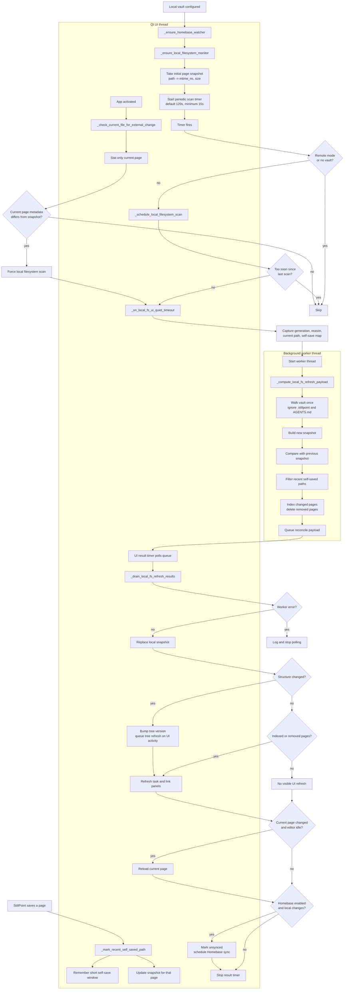

# Local File System Handling

* [ ] StillPoint no longer depends on recursively registering every vault directory with
  `QFileSystemWatcher`. Local changes are detected through a coarse snapshot scan,
  with the expensive work pushed into a background thread and the UI updated only
  after the worker returns a compact result.

Notes:

- The expensive periodic refresh path is non-blocking for the UI: vault walking,
  snapshot comparison, page reads, and incremental indexing happen in the worker
  thread.
- The periodic cadence is configurable through
  `local_filesystem_scan_interval_seconds`; the loader clamps it to at least 15
  seconds and defaults to 120 seconds.
- The scheduler also applies a short minimum gap between non-forced scan
  requests, so activation or repeated timer events cannot immediately pile up.
- Self-saves are recorded for a short window and the saved page's snapshot entry
  is updated immediately. That prevents StillPoint from treating its own write as
  an external edit on the next scan.
- One remaining synchronous cost is the initial snapshot in
  `_ensure_local_filesystem_monitor`. If very large vaults still lag on open,
  that initial snapshot is the next candidate to move into the worker path.
