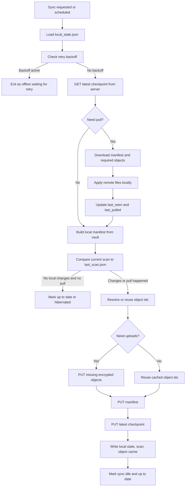
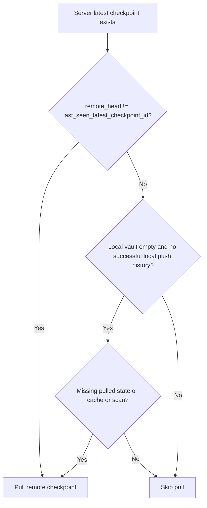
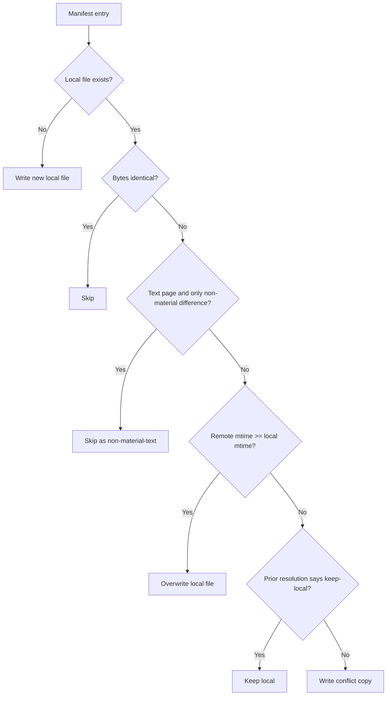
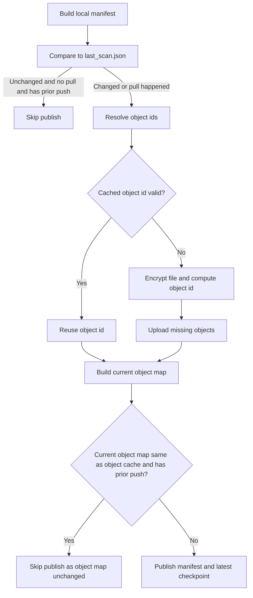
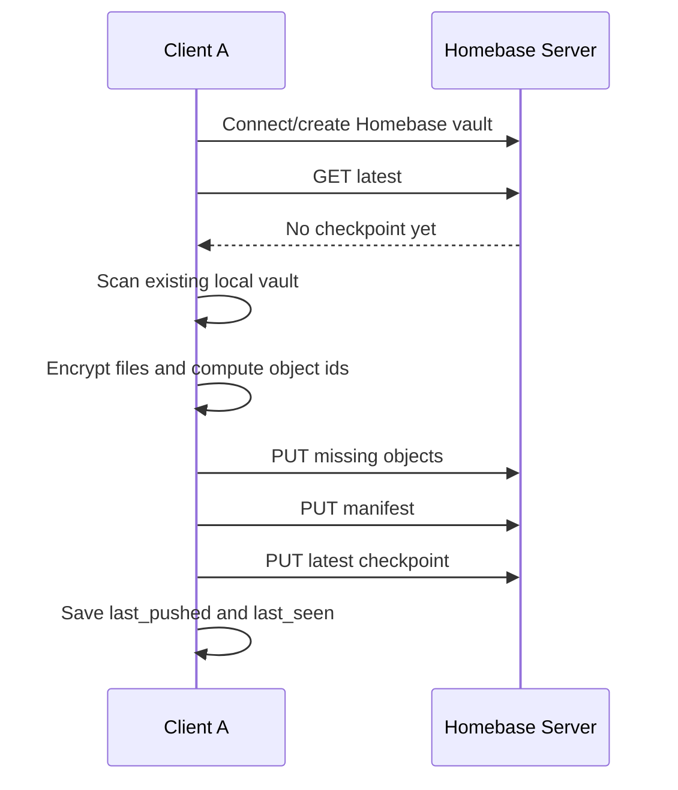
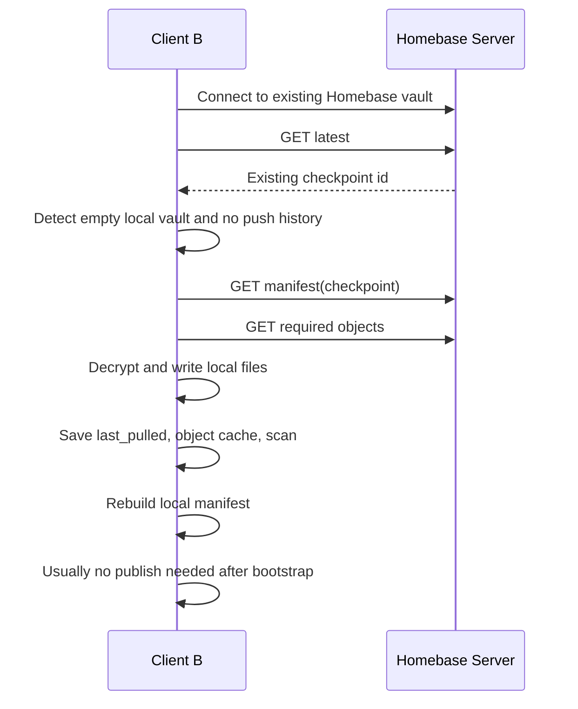
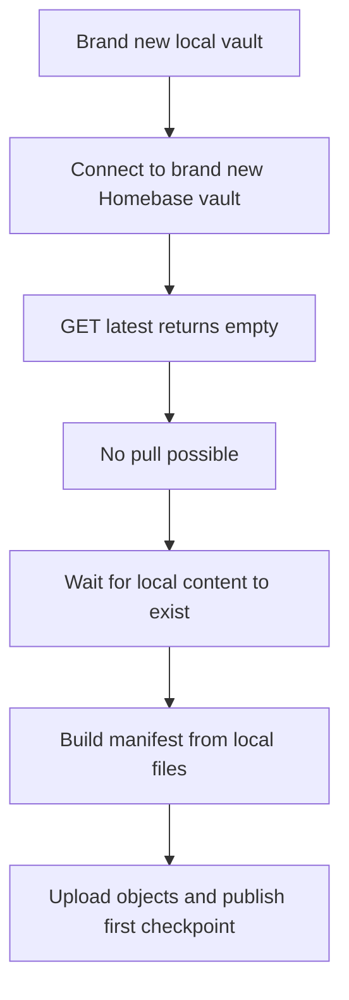

# Homebase Sync Behavior

This document describes how the current Homebase sync engine behaves in StillPoint.

It covers:

- regular sync operation
- onboarding from an existing local non-Homebase vault
- onboarding a fresh client from an existing Homebase vault
- the state files and decision points that determine pull vs push
- conflict behavior and “material change” filtering

The behavior described here matches the current engine in `sp/sync/engine.py`.

## Core Model

Homebase is a local-first sync system.

- The local vault on disk is the working copy.
- The server stores encrypted objects plus manifest/checkpoint metadata.
- Each sync cycle decides whether to:
  - pull remote state first
  - skip work because nothing changed
  - upload local changes and publish a new checkpoint

At a high level:

1. Read local sync state.
2. Ask the server for the latest checkpoint.
3. Decide whether a pull is required.
4. Build a new manifest from the local vault.
5. Decide whether any objects must be uploaded.
6. Publish a new manifest/checkpoint if local state changed.

## Important Local State

The engine uses these local files under `.stillpoint/sync/`:

- `local_state.json`
- `last_scan.json`
- `object_cache.json`
- `conflict_log.json`

The most important fields in `local_state.json` are:

- `last_seen_latest_checkpoint_id`
  Meaning: the latest remote checkpoint this client knows about
- `last_pulled_checkpoint_id`
  Meaning: the latest remote checkpoint this client actually applied locally
- `last_pushed_checkpoint_id`
  Meaning: the latest checkpoint this client successfully published
- `last_sync_at`
- `last_error`
- `error_count`
- `backoff_until`

The most important fields in `last_scan.json` are:

- per-path `size`
- per-path `mtime`

This lets the engine tell whether the local filesystem changed since the last completed sync.

The most important fields in `object_cache.json` are:

- `path -> object_id`

This lets the engine reuse already-known object ids for unchanged local files instead of re-encrypting and re-uploading them every cycle.

## Remote Model

The server stores:

- encrypted objects
- manifests
- a latest checkpoint pointer

A manifest is a snapshot of:

- file path
- file size
- file mtime
- object id

A checkpoint id is derived from manifest bytes and acts like an immutable snapshot id.

## Full Sync Cycle

## Pull Decision

The pull decision happens before local push work starts.

The engine loads:

- `remote_head` from the server
- `last_seen_latest_checkpoint_id`
- `last_pulled_checkpoint_id`
- `last_pushed_checkpoint_id`
- `object_cache.json`
- `last_scan.json`
- current local file count

Then it decides whether to pull.

### Normal Pull Rule

If:

- `remote_head` exists
- and `remote_head != last_seen_latest_checkpoint_id`

then the client pulls.

This is the normal “another device published something new” path.

### Bootstrap Pull Rule

There is also a special bootstrap rule for a fresh local vault.

If all of these are true:

- `remote_head` exists
- local file count is `0`
- `last_pushed_checkpoint_id` is empty
- and at least one of these is true:
  - `last_pulled_checkpoint_id` is empty
  - `object_cache.json` is empty
  - `last_scan.json` is empty

then the engine forces a pull even if `remote_head == last_seen_latest_checkpoint_id`.

This protects a fresh client from acting as if it is already hydrated when the local vault is actually empty.

## How Pull Applies Remote State

When a pull happens, the engine:

1. downloads the manifest for the remote checkpoint
2. walks each manifest entry
3. downloads and decrypts each required object
4. decides whether to:
   - write a new local file
   - overwrite a local file
   - skip because file is already equivalent
   - create a conflict copy

### Pull Outcomes

For each file, the engine can do one of these:

- `new-file`
  The local path does not exist, so write it.
- `overwrite-lww`
  Remote mtime is newer or equal, so overwrite local.
- `keep-local`
  A prior conflict resolution already said to keep local for this checkpoint.
- `conflict-copy`
  Local file differs and local looks newer, so keep local and write remote as a conflict copy.
- `non-material-text`
  The text differs at the byte level, but not in a meaningful way, so skip conflict and skip overwrite.

### Material Change Filtering

For Markdown/text pages, the engine now treats these as non-material:

- trailing newline-only differences
- title-only scaffold pages that differ only by blank lines

Examples considered non-material:

- `# Page`
- `# Page\n`
- `# Page\n\n`

If both sides are effectively just the same heading-only page, the engine does not raise a conflict.

## How Push Works

After any pull work is done, the engine builds a fresh local manifest by scanning all syncable local files.

Each manifest entry contains:

- `size`
- `mtime`
- `kind=file`
- `object_id`

At first the new manifest has blank object ids. The engine then fills them in.

### Object Reuse

For each local file, the engine tries to avoid unnecessary upload work.

It prefers object ids from:

1. `pulled_object_cache`
   These came directly from the pulled manifest and are trusted.
2. `object_cache.json`
   These are reused if the file’s `size` and `mtime` still match the last scan.

If the cache may be stale, the engine verifies that the object still exists on the server before reusing it.

If no safe cached object id is available:

- read local plaintext
- encrypt it
- compute `object_id`
- queue upload if the server does not already have that object

### Push Skip Cases

The engine may skip publishing for two reasons:

1. Scan unchanged, no pull happened, and there was already a successful push history
   Result: `Up to date` or `Hibernated`

2. Current object map equals cached object map and there was already a successful push history
   Result: `Up to date`

This prevents republishing a new checkpoint when local content is already represented by the same object set.

## Regular Operation: Existing Homebase Client

This is the steady-state flow after onboarding.

### When another client publishes changes

- server latest checkpoint changes
- next sync sees `remote_head != last_seen_latest_checkpoint_id`
- current client pulls first
- local vault is updated
- then engine rebuilds its manifest and decides if anything local still needs to be published

### When only local edits happened

- no remote pull is needed
- local scan differs from last scan
- engine resolves object ids
- uploads missing encrypted objects
- publishes a new manifest/checkpoint

### When nothing changed

- pull is skipped
- scan is unchanged
- push is skipped
- after several unchanged checks the engine can enter hibernation

## Onboarding Path 1: Existing Local Non-Homebase Vault to New Homebase Vault

This is the “Client A” case.

Starting conditions:

- local vault already has files
- remote Homebase vault is new or has no latest checkpoint yet

Result:

- engine treats local vault as the initial source of truth
- builds local manifest
- encrypts files into objects
- uploads objects
- uploads manifest
- publishes latest checkpoint

### Why this pushes instead of pulls

- there is no remote head to pull from
- local vault is not empty
- engine proceeds directly to manifest creation and publish

## Onboarding Path 2: Fresh Client Folder to Existing Homebase Vault

This is the “Client B” case.

Starting conditions:

- local folder is fresh or effectively empty
- remote Homebase vault already has a latest checkpoint

Result:

- engine detects bootstrap pull conditions
- downloads the remote manifest
- downloads and decrypts remote objects
- recreates the vault locally
- saves `last_pulled_checkpoint_id`, object cache, and scan

### Why this pulls instead of pushing an empty manifest

Because the engine now explicitly checks:

- remote head exists
- local vault has zero files
- there is no successful local push history
- local sync metadata/cache/scan do not prove the vault was already hydrated

That combination forces bootstrap pull.

## Onboarding Path 3: Brand New Local Vault and Brand New Homebase Vault

This is the “both sides are new” case.

Possible starting states:

- local vault is empty except for whatever StillPoint scaffolds when pages are created later
- remote has no latest checkpoint

Result:

- no pull happens because there is no remote checkpoint
- the first meaningful local content that gets created becomes the first push

## Hibernation

If repeated sync checks find no local changes and no remote changes, the engine can hibernate.

That means:

- state becomes `hibernated`
- summary becomes `Hibernated (waiting for edits/page load)`

This is just an efficiency optimization. A manual sync, local edit, or scheduled event can wake it back up.

## Error Handling

### 401 / Auth Failures

If a sync request gets `401`:

- engine tries refresh token flow once
- if refresh succeeds, retry sync once
- if refresh fails, mark status as unauthorized/offline

### Network / HTTP / IO Errors

If sync fails:

- `error_count` increments
- exponential backoff is written into `backoff_until`
- status becomes offline with pending changes

### Decryption Failure

If a pulled object cannot be decrypted:

- sync fails
- status becomes auth/passphrase related error

This usually means:

- wrong Homebase passphrase
- corrupted object

## Conflict Behavior

Homebase is conservative.

When a remote file and local file differ materially, and the local file appears newer, the engine does not silently overwrite local work. Instead it:

- keeps the local file
- writes the remote version as a conflict copy
- records an entry in `conflict_log.json`

The user can then resolve it from the UI.

The main exception now is non-material text differences, which are intentionally ignored for conflict purposes.

## Practical Summary

### Existing local vault, new Homebase vault

- first sync pushes local vault up

### Fresh local folder, existing Homebase vault

- first sync pulls remote vault down

### Existing Homebase client in normal use

- pull first if server head changed
- then decide whether local state needs a publish

### Nothing changed

- skip pull/push work
- eventually hibernate

## Mental Model

The simplest mental model is:

- Homebase sync always checks remote first
- local filesystem is always scanned every active cycle
- a fresh empty client with an existing remote vault should hydrate from server
- a client with real local edits publishes a new checkpoint
- conflicts are file-level and conservative
- meaningless text-only scaffolding differences should not bother the user
