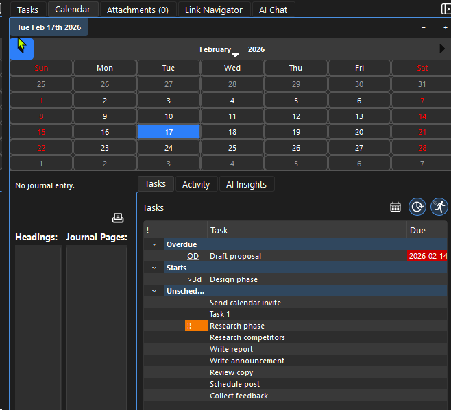

# Calendar

## What Is the Calendar?
Calendar is the journal command center for your vault.
- It helps you plan what to do, track what you did, and review your work over time.
- Journal pages are stored on disk under the `Journal/YYYY/MM/DD/` structure.
- Journal content is usually hidden from the main file tree by default to reduce noise, but you can show it when needed.

## The Lightbulb Moment
Think of Calendar as your durable memory system:
- Your daily pages capture intent (plans) and evidence (what actually happened).
- Selected dates show tasks scoped to those days, so planning and review happen in one place.
- Activity lists show journal headings and related subpages, so you can answer, "What did I do that day?"
- If AI is enabled, Calendar can generate day-level summaries from journal content.
- When you link journal entries to project pages, your vault graph becomes a timeline of real work.

## Date Formats
Common date format in tasks/journal context:
- `YYYY-MM-DD` (example: `2026-02-16`)

## Viewing Notes by Date
- Click a date to load that day’s task/activity context.
- Shift-click to select a range of days and review a whole period at once.
- Use the Activity and Tasks tabs to switch between narrative review and execution planning.
- As the panel gets wider, adjacent month views appear for better context.
- You can open Calendar in its own window (`View -> Open Calendar Window`) for planning on a second monitor.

## Creating Dated Notes
- Open today quickly with `Alt+D`.
- Open or create entries for specific dates from the calendar.
- Add notes, tasks, links, and subpages for that day.
- Use the Tasks tab to schedule quickly: click date cells to set/update start and due dates.
- Filter tasks by range and context so planning stays focused on the selected dates.

## Journaling
Use the calendar for daily journaling:
- Capture the day plan in the morning.
- Schedule future notes to yourself on upcoming dates; they will be waiting when that day arrives.
- Update outcomes during/after work.
- Link to project pages as you go.
- Revisit any day, week, or month when you need a trustworthy record.

## Tips
- Keep one lightweight daily page habit.
- Create subpages under a journal day for longer work, so the day page stays a clean index.
- Add due/start dates to tasks so calendar planning stays actionable.
- Use range selection for weekly reviews.
- Use detached Calendar + Tasks windows when doing focused planning sessions.
