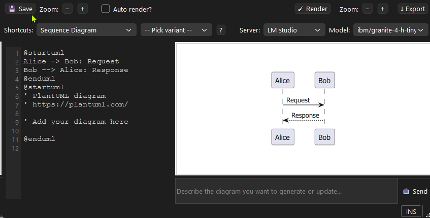
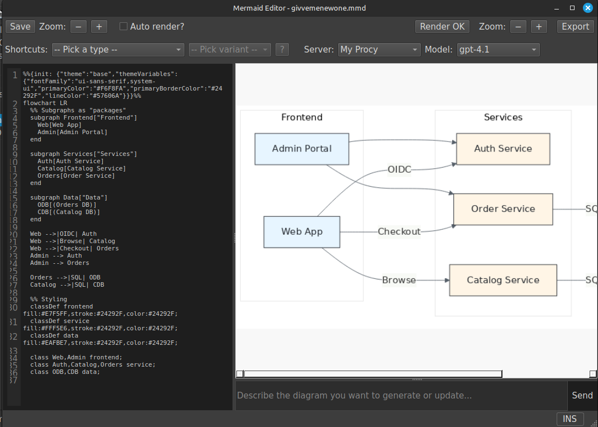

# Diagramming
## What This Page Covers
StillPoint supports diagramming with two engines:
- **PlantUML**
- **Mermaid**

Use diagrams when text alone is not enough: architecture, workflows, timelines, dependencies, and planning views.

## AI-Assisted Iteration
If AI is enabled, you can iterate on diagrams quickly by asking AI to draft or refine diagram text, then adjusting the result in your diagram page/editor.

## Dedicated Diagram Files
- Create and store `.puml` (PlantUML) and `.mmd` (Mermaid) files with your page attachments.
- Right-click in Attachments to create new diagram files.
- Open them from the Attachments panel.
- Double-click to open in the dedicated diagram editors.
- Keep diagrams next to the page where they are explained.

## Supported PlantUML Diagram Types
- Sequence Diagram
- Use Case Diagram
- Class Diagram
- Activity Diagram (beta)
- Component Diagram
- State Diagram
- Object Diagram
- Deployment Diagram
- Timing Diagram
- Regex Diagram
- nwdiag Network Diagram
- SALT Diagram
- ArchiMate Diagram
- Gantt Diagram
- Mind Map Diagram
- WBS Diagram
- JSON Diagram
- YAML Diagram

## Supported Mermaid Diagram Types
- Sequence Diagram
- Flowchart Diagram
- Class Diagram
- State Diagram
- Entity Relationship Diagram
- Gantt Diagram
- Mindmap Diagram
- Timeline Diagram
- Pie Chart
- User Journey Diagram
- Git Graph Diagram
- Requirement Diagram

## Docs References
Official syntax references:
- PlantUML: https://plantuml.com/
- Mermaid: https://mermaid.ai/open-source/syntax/

## Practical Tips
- Start simple, then add detail once the structure is clear.
- Keep one diagram per page section when possible.
- Link diagram pages to related notes/tasks so your vault graph stays meaningful.
- Use diagrams for weekly planning/review, not just system design.

{width=600}

{width=600}
