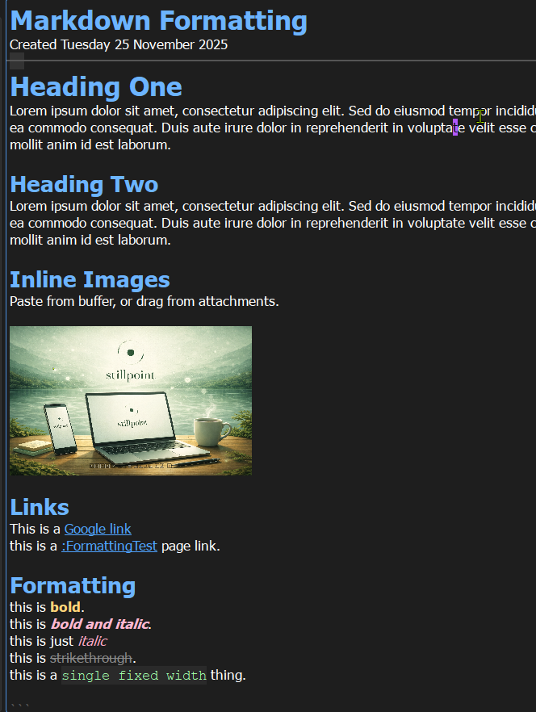

# Editor

StillPoint’s editor is a Markdown editor designed for fast note-taking, linking, and task tracking.

## Quick Start
- Type normally. Your page auto-saves as you edit.
- Use headings to structure your page.
- Add links between related pages.
- Add tasks directly inside notes.

## Markdown Basics
StillPoint uses standard Markdown with a few workflow-friendly additions.

It visual like a word processor, but `plain text` on your disk.



### Headings
- `#` main title
- `##` section
- `###` subsection
- You can type heading markers directly, or use shortcuts: `Ctrl+1` to `Ctrl+5`.

### Text Formatting
- `*italic*` or `_italic_`
- `**bold**` or `__bold__`
- `` `code` `` for inline code
- You can also apply formatting from keyboard shortcuts in the Format menu.

### Lists
- `-` for dash lists
- `•` for bullet lists
- `- [ ]` for checkbox task lists
- Focus on bullets and task lists as your primary structure.

### Links
- `[text](url)` for external links
- `:PageName` for internal page links
- `[:PageName|Display Text]` for custom link labels
- Best practice: create links with `// ` (quick link picker), `Ctrl+L`, or by creating a new page (`Ctrl+N` or right-click -> `New Page`).

### Code Blocks
```language
code here
```

## Tasks in Notes
Tasks live directly in your pages, so planning and notes stay together.

- Type `()` then space to create a new task
- Type `(x)` then space to create a completed task
- Press `F12` on a task line to toggle complete/incomplete
- Add task tags with `@tagname` (example: `@errands`, `@email`)

You can also add date markers in task text:
- `<2026-02-16` for due-style dates
- `>2026-03-30` for start-style dates

Example:
```markdown
- [ ] Buy supplies @errands <2026-02-16
- [ ] Draft launch email @email >2026-03-30
```

## Inline Helpers
- Page tags: type `/# ` to browse existing page tags and insert one
- Task tags: type `/@ ` on a task line to browse task tags and insert one
- AI prompt: type `/ai ` (trailing space) to open inline AI prompt when AI is enabled

## Find and Replace
- `Ctrl+F` to find text on the current page
- `Ctrl+H` to replace text
- In VI mode, use `/` for quick in-page search and replace

## Printing
- Printing is powerful: print a page to the browser for clean output/PDF export, or print page-tree views for structured sharing.
- Use `File -> Print`, `Ctrl+P`, or right-click menus.

## Working Modes and Extras
- Use the editor for normal writing, journaling, task tracking, and link-based knowledge work.
- Open important pages in separate editor windows when you want side-by-side focus. `Page/Open Page in new Editor`.
  - This is great for reviewing several pages while consolidating notes into one page.
- Use related panels (like navigation and outline/toc features) to move through long pages faster.
- Focus Mode is great when you want distraction-free writing and cleaner concentration.
- If AI is enabled, use inline `/ai ` prompts and AI panels to draft, summarize, and iterate faster without leaving your notes.
- Audience Mode is useful for sharing notes live, with larger readable text and reduced editing clutter.

## New User Tips
- Start simple: one page per topic, connected by links.
- Use headings early so pages stay easy to scan.
- Keep tasks close to the notes they belong to.
- Add tags only when you feel real grouping pain.
