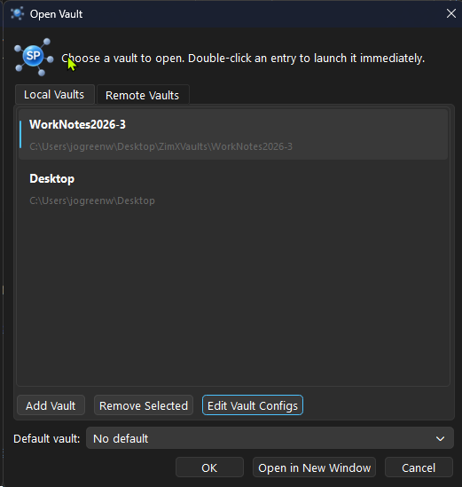
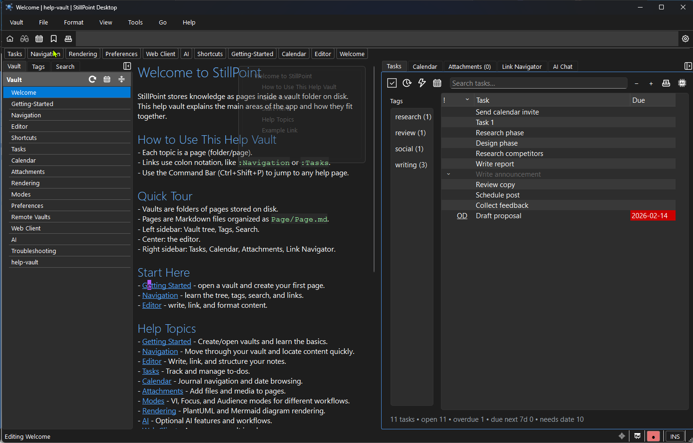

# Getting Started

## First Time Setup


When you first run StillPoint, you will see a welcome screen.
- Click `Create New Vault` to start fresh.
- Click `Open Existing Vault` to use a vault you already have.
- A vault is just a folder on your computer with Markdown pages inside it.

Tip: many users create a `vaults/` folder (for example on Desktop or Documents) and keep each vault in its own subfolder.
update: talk about setting default vault or not.

## Create or Open a Vault
- Use Vault -> New Vault to create a new vault.
- Use Vault -> Open Vault in New Window to open a different vault.
- If you want sync across devices, configure Homebase for the vault after opening it locally.

## Vault Structure
StillPoint stores pages in matching folders.
Example structure:
```
MyNotes/
  MyNotes.md
  Projects/
    Projects.md
    Website/
      Website.md
```

## Core Layout

{width=900}

- Left sidebar: Vault tree, Tags, Search.
- Center: Editor.
- Right sidebar: Tasks, Calendar, Attachments, Link Navigator, and AI (if enabled).

## First Page
- Create your first page using one of these options:
  - Press `Ctrl+N`
  - Right-click in the page tree and choose `New Page`
- Pages are saved as Markdown files on disk.


## Templates
Templates help you create consistent pages quickly.
- You can make templates for common pages like meeting notes, daily logs, or project plans.
- Templates can include swap variables (placeholders) that are filled in when the page is created.
- Start simple: create one template you use often, then expand over time.


## Saving
- StillPoint saves automatically as you type.
- Use `Ctrl+S` to force a save at any time.

## Terminal and Coding Agent Workflow
- Use `Vault -> Open Vault in Terminal` to open the actual vault folder in your system terminal.
- Run coding agents, TUIs, scripts, or other local tools directly in that folder.
- StillPoint understands the StillPoint page-folder structure and can refresh when files are created locally.
- If Homebase is enabled, those local filesystem changes can sync to your other devices.

## Switching Vaults
- Use Vault -> Open Vault in New Window to work in multiple vaults at once.

## Next Steps
- Learn about [:Editor|Editor] and [:Navigation|Navigation].
- Try adding [:Tasks|Tasks] and [:Calendar|Calendar].
- Visit [:Welcome|Welcome] for the bigger-picture view of how people use StillPoint day to day.
