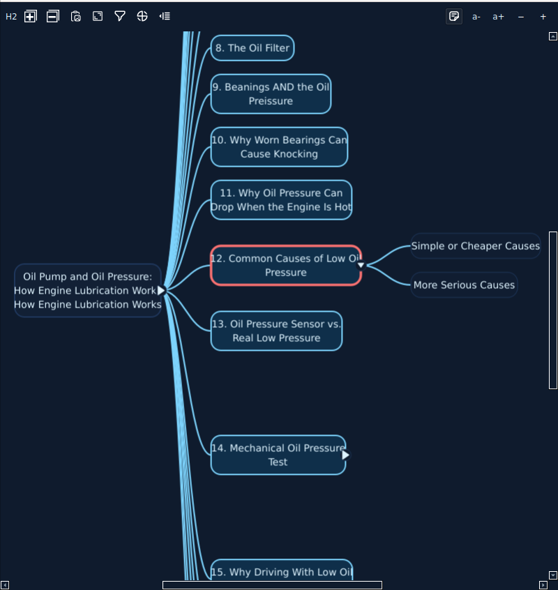
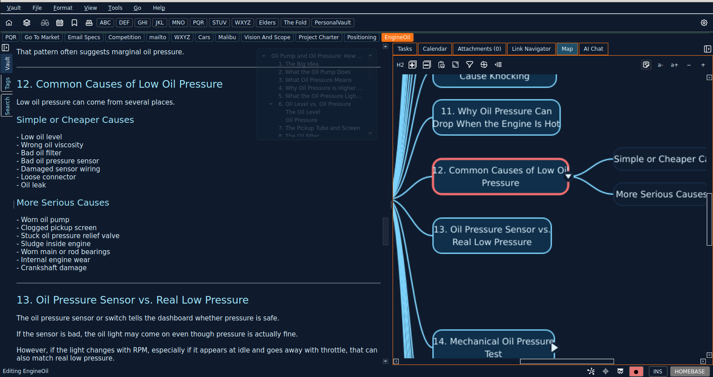

# Mindmap Mode

Mindmap Mode gives you a visual way to read and shape a markdown page.

You are still editing the same page. StillPoint simply presents the structure as connected heading nodes so you can think in branches, then drop back into text as needed.

## What You Can Do
- Visualize markdown structure as a mindmap.
- Read through long documents more visually.
- Brainstorm and take notes while reshaping page structure.
- Move nodes and regroup sections to achieve the structure you want.
- Flip back and forth between document authoring and visual structure.
- Filter the hierarchy to focus on just one part of a complex page.

## Mindmap Workflows
### Full Page Mindmap View
Open a dedicated full-page map window to focus on structure and visual reading.

### Side-by-Side with Document Authoring
Use the Map tab while editing the page so structure and writing evolve together.

## How to Open Mindmap Mode
- Right-click in the editor and choose `View -> View in Map Mode`.
- Click the status bar mindmap icon (`Open in Mindmap mode`).
- Use the right panel Map tab for side-by-side editing.

## Practical Tips
- Use map filtering when the page gets large.
- Keep one branch expanded while drafting.
- Use the map to plan section flow first, then refine details in markdown.

## Keyboard Highlights
- `f` fits the visible map as tightly as possible in the viewport.
- `Alt+[` filters to the selected subtree and `Alt+]` clears the filter.
- `Ctrl+Enter` opens the selected node and focuses the editor.
- `Shift+Enter` opens the selected node while keeping focus in the map.
- `Alt+Enter` edits the selected node name inline.
- `Ctrl+Space` toggles the selected node note popup.
- `Space` folds or unfolds the selected node. On the root/title node, it hides or shows the H1 branches.
- `Esc` collapses the map back to the root/title node and centers it.
- In the note popup, `Up` / `Down` scroll by line and `Left` / `Right` close the popup.
- In VI mode, `j` / `k` scroll the popup by line, `Ctrl+Shift+J` / `Ctrl+Shift+K` scroll by page, and `h` / `l` close the popup.
