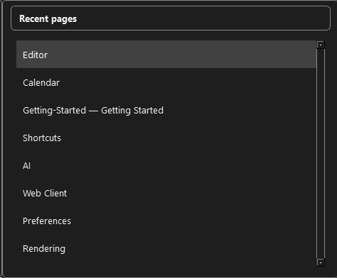
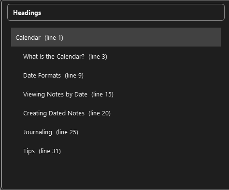

# Navigation

StillPoint is designed so you can move quickly once your vault grows. Start with the mouse while learning, then add shortcuts to stay in flow without breaking focus.

## Vault Tree
The left sidebar shows your vault structure.
- Click a page name to open it in the editor.
- Expand/collapse folders with the arrow icons.
- Right-click for more options like rename or delete.
- You can right-click a folder/page and filter navigation from that point.
- Filtering acts like a project-focused zoom:
  - The app treats that location as your working context.
  - Tasks, jump dialogs, and link pickers follow that filtered scope.

## Quick Ways to Move Around
- `Ctrl+J`: jump to a page quickly.
- `Ctrl+Shift+P`: open Command Bar (pages, commands, settings).
- `Alt+Left` / `Alt+Right`: back/forward in history.
- `Alt+Home`: go to your home page.
- `Alt+PgUp` / `Alt+PgDown`: cycle through pages in the current nav list.

## Quick Switchers
- `Ctrl+Tab`: cycle through recent pages so you can jump back to something you were just working on.
- `Ctrl+Shift+Tab`: open/cycle page headings so you can jump to a section in the current page.
- These are great when you want to stay in the editor and move without touching the mouse.

Recent pages (`Ctrl+Tab`):


Topics/headings (`Ctrl+Shift+Tab`):


## Keyboard-First Flow
You do not need to memorize everything at once. A strong starter flow is:
- Use `Ctrl+J` to jump directly to pages.
- Use `Ctrl+Shift+P` for commands instead of hunting in menus.
- Use `Alt+Left` / `Alt+Right` to move through your recent context.
- Use `Alt+Home` when you want a consistent reset point.

As these become habits, navigation feels much faster and more focused.

## Bookmarks Bar
The top toolbar includes bookmarks so important pages are always one click away.
- Use `Ctrl+Alt+B` to add or remove a bookmark for the current page.
- Use bookmarks for your daily start points (for example: Today page, active project, weekly review).
- The bookmark strip can scroll left/right when you have many saved pages.
- Bookmarks are great for staying on point across sessions.

## Tags
Tags help group related pages.
- Page tags use `#tagname` and can appear anywhere in a page (task lines are ignored).
- Task tags use `@tagname` and stay scoped to tasks (on task checkbox lines).
- Tag picker: type `/# ` in the editor to browse existing page tags and insert one.
- Task tag picker: type `/@ ` on a task line to browse existing task tags and insert one.
- Click a tag in the Tags panel to see all pages with that tag.
- Use tags to organize by project, topic, or status.

Example:
```markdown
# Project Plan

Status: #active #project

- [ ] Research phase @task1
- [ ] Design phase @task2
```

## Search
Find anything in your vault quickly.
- Type in the Search box to scan all pages.
- Search looks in page titles and content.
- Use quotes for exact phrases: `"project plan"`
- Results show matching pages with snippets.

## Link Navigator
Explore connections between pages.
- Shows a graph of how pages link to each other.
- Backlinks show which pages reference the current page.
- Click nodes to navigate, drag to rearrange.
- Optional views can include attachments and raw link details.

## Command Bar
Quick access to everything.
- Press `Ctrl+Shift+P` to open.
- Type to search pages, commands, or settings.
- Examples: type "new page" or "preferences".

## Tips
- Use the vault tree for browsing.
- Use search for finding specific content.
- Use tags for ongoing projects.
- Use tree filtering to zoom into a subproject and reduce noise.
