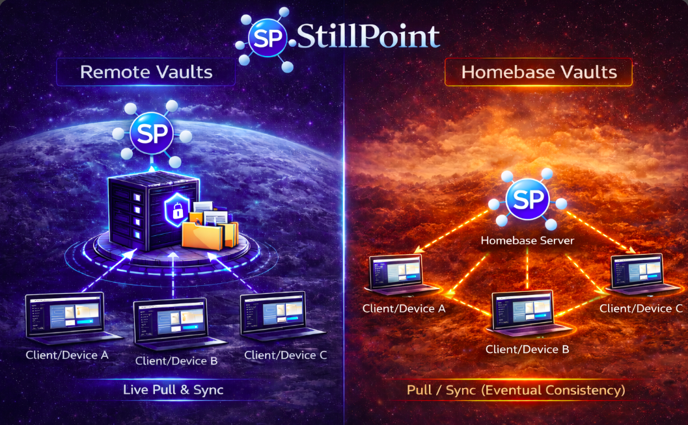

# Homebase Vaults

{width=600}

StillPoint is now a local-first system:
- **Local Vaults** live directly on your filesystem.
- **Homebase Vaults** add sync on top of that local filesystem model.

Homebase is the only remote-capable vault model. Each device keeps a real local copy of the vault, and Homebase synchronizes those copies through the server.

## What Homebase Is

Homebase Vaults are local-first with distributed sync.
- Each device keeps a local working copy.
- Devices sync by pushing/pulling through the Homebase server.
- The model is **Git-like**: local work first, then synchronize.
- Your vault is still a normal folder full of Markdown files and attachments.

## Sync Model
- Push/pull with **eventual consistency**.
- Works offline, then syncs when connected.
- Conflict-aware workflow when concurrent edits happen.
- Filesystem changes made by StillPoint, your editor, scripts, or CLI tools all flow into the same local vault and can then sync through Homebase.

## User Management
Homebase supports account auth and user management APIs.
- Roles and write permissions are enforced by server auth.
- Admin users can manage users.
- Normal read users can authenticate and view, but writes are blocked.

## When To Choose Homebase
- You need multi-device continuity with offline-first behavior.
- You want a distributed sync mental model similar to Git.
- You prefer local-first work with periodic synchronization.
- You want the server to be outside your plaintext trust boundary.
- You want to use local editors, coding agents, or TUIs against the vault files themselves.

## Security Model
- Server stores encrypted blobs and sync metadata.
- Encryption passphrase stays local on client devices.
- Auth tokens control access, but tokens are not your encryption key.

## Passphrase Storage
- By default, StillPoint does not store your Homebase encryption passphrase on disk.
- During Homebase setup or `Reset Encryption Passphrase`, you can opt into `Store passphrase on this device`.
- Only enable that option if you trust the device. The passphrase is then stored in the vault's local StillPoint config.
- Passwords are still not stored. You authenticate once, then StillPoint reuses Homebase access and refresh tokens.
- StillPoint also writes non-secret Homebase recovery metadata into the vault under `.stillpoint/homebase.json` so re-adding the vault later can prefill the server URL, SSL mode, vault ID, and vault name.

## Local Recovery
- Homebase saves the previous local bytes before a pull overwrites or deletes a file. Recovery data stays on this device outside the vault, under `~/.stillpoint/homebase-recovery/`.
- Open **Local Recovery** from the Homebase sync summary or the Remote Vault menu to inspect changes, restore selected files or an entire pull, export prior copies, and pin a recovery point.
- Choose **Open Local Backup Folder** from the Homebase sync summary, Homebase menu, or Local Recovery window to inspect this device's recovery storage in the file manager.
- A restore becomes a new local edit and syncs normally. It does not move the server checkpoint backward.
- Large or unusually destructive pulls pause for review. If a pull is interrupted, Homebase pauses syncing until you review the recovery event and choose to continue.
- Local recovery is enabled by default. Its storage quota and retention settings are in the Homebase sync summary.

Homebase never opens Local Recovery over the main window during startup. When review is needed, the Homebase status badge turns amber. Click the badge to review protected changes or an interrupted pull.

## Sync Problems

- A red Homebase badge means an active authentication, connection, conflict, or per-file sync problem needs attention.
- Click the badge to open the relevant review screen. **Retry Failed Files** retries an incomplete pull before local uploads continue.
- A file problem that predates a later successful sync is shown as resolved history and does not block uploads. Resolved history can be dismissed.
- Raw operating-system errors, object IDs, checkpoints, and device IDs are available under technical details or tooltips.
- **Delete selected path from shared Homebase** is an advanced destructive action. It is available only for an unrepresentable path that is absent locally.

## Choosing an Authoritative Copy

- **Reset Sync State (Server Authoritative)** replaces matching local content with the current Homebase snapshot and protects affected local files through Local Recovery.
- **Publish This Device as Authoritative** does the opposite: it lists every file that will be added, replaced, or removed; shows text contents or a Homebase-to-local diff where practical; requires the vault name as confirmation; and replaces the shared Homebase snapshot with this device's current files.
- An authoritative local publish aborts if the Homebase head changes after the preview. Use it only when you deliberately want local files—including local deletions—to win.

## Practical Takeaway
- Use a **Local Vault** when you only need files on one machine.
- Use a **Homebase Vault** when you want sync, offline-first behavior, and a stronger local-first trust boundary.

## Coding Agents and TUIs
StillPoint works especially well with coding agents and terminal workflows because the vault is a real local folder.

Recommended workflow:
1. Open the vault locally.
2. Use `Vault -> Open Vault in Terminal`.
3. Run your coding agent, TUI, or CLI tool in that vault root.
4. Let StillPoint detect filesystem changes and refresh the tree.
5. If Homebase is enabled, let sync push those local changes to the server.

StillPoint seeds an `AGENTS.md` file at the vault root if that preference is enabled. That file teaches agents the StillPoint page structure, colon-link rules, and page-folder conventions.

This makes Homebase a strong fit for:
- AI-assisted research vault growth
- script-driven imports
- TUI note workflows
- code-generated pages and attachments

## Setup Notes

### Local Vault
1. Create or open a vault folder on disk.
2. Work directly against that folder in StillPoint or other local tools.

### Homebase Vault
1. Create/connect a Homebase vault profile.
2. Authenticate to Homebase.
3. Decide whether to keep the encryption passphrase session-only or store it on this trusted device.
4. Let local sync engine pull/push changes.
5. Use sync status and conflict tools from the Homebase UI.

## Operational Tips
- Back up your local vault and Homebase server data regularly.
- Use TLS for any non-local network use.
- Review user roles periodically.
- For agent or CLI workflows, prefer additive page creation and let StillPoint/Homebase handle the sync layer.
- The Homebase Sync dialog keeps **Reset Auth** and **Reset Encryption Passphrase** in its always-visible Recovery row. Sync settings, manual sync, conflicts, sync errors, and Close remain available in the same dialog.
