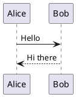

# Rendering

## What Is Rendering?
StillPoint can render diagrams and charts from text.
- **PlantUML**: Create diagrams from simple text
- **Mermaid**: Flowcharts, Gantt charts, and more
- **Math**: LaTeX math expressions

## PlantUML Diagrams
Create diagrams using text:

- Supports sequence, class, use case, and activity diagrams
- Diagrams render automatically in the editor

## Mermaid Charts
Create charts and graphs:

- Supports flowcharts, sequence diagrams, Gantt charts
- Pie charts, git graphs, and state diagrams

## Math Expressions
Render mathematical formulas:
```math
E = mc^2
```
Or inline: $E = mc^2$
- Uses LaTeX syntax
- Supports fractions, integrals, matrices, etc.

## Code Blocks
Syntax highlighting for code:
```python
def hello():
    print('Hello, world!')
```
- Supports many programming languages
- Line numbers and copy buttons

## Tables
Create formatted tables:
| Header 1 | Header 2 |
|----------|----------|
| Cell 1   | Cell 2   |
| Cell 3   | Cell 4   |

## Enabling Rendering
- Rendering is enabled by default
- Check Preferences if diagrams don't appear
- Some features require internet for rendering

## Tips
- Use PlantUML for technical diagrams
- Mermaid is great for flowcharts and processes
- Math expressions work in both blocks and inline
- Tables help organize structured data
