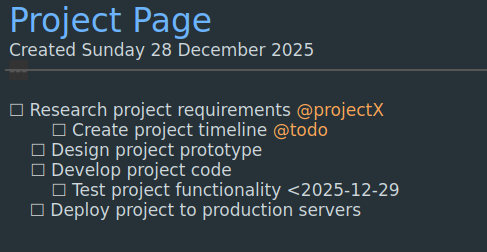
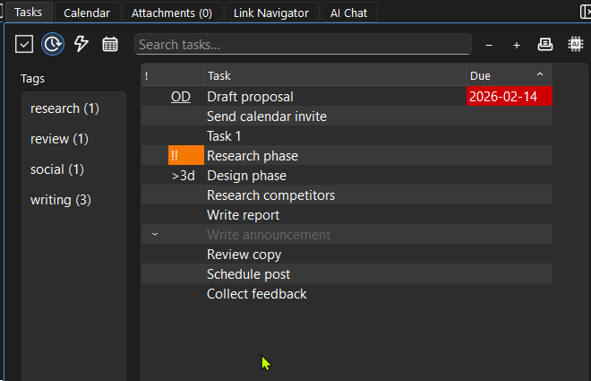

# Tasks

## What Are Tasks?


Tasks are checkboxes inside your notes.
- Keep planning and execution in the same place.
- No separate task app required.
- Every task stays connected to its original page context.

## Task Syntax
Fast entry:
- Type `()` then space to create a new task.
- Type `(x)` then space to create a completed task.
- Press `F12` on a task line to toggle done/undone.

Task line options:
- `@tag` for task categories (example: `@work`, `@email`)
- `>YYYY-MM-DD` for start date
- `<YYYY-MM-DD` for due date
- `!`, `!!`, `!!!` for priority emphasis

Example:
```markdown
# Project Tasks

- [ ] Research competitors @work !! >2026-02-10 <2026-02-14
- [x] Set up kickoff meeting @team
- [ ] Write report @writing ! <2026-02-20

- Use `Ctrl+D` to insert dates quickly from a date dialog.
- The date input supports natural language like `today`, `tomorrow`, and `next week`.

## Task Panel


The Tasks panel shows all tasks from your vault.
- Activate a task to jump straight to the page and line.
- Double-click on the priority/checkbox column to toggle completion.
- Click or double-click date columns to update start/due dates quickly.
- Use the search box to filter tasks.
- While editing, use `Ctrl+\` to jump focus to Tasks quickly.
- Fast keyboard flow: `Ctrl+\` -> type search text -> arrow keys -> Enter -> jump to task in editor.
- Open the Tasks panel in its own window (`View -> Open Task Panel Window`) to keep it on a second monitor.

## Filtering Tasks
- Type keywords to find specific tasks.
- Use tags like `@work` or `@personal`.
- Type `/@ ` on a task line to insert a task tag from the picker.
- Use start/due dates to narrow time-based work.

Example filters:
- `@work` - show work-related tasks
- `meeting` - show tasks mentioning meetings

## Task Date Formats
Use date markers directly in task lines:
- `>YYYY-MM-DD` = starts on/after date
- `<YYYY-MM-DD` = due by date
You can include both on the same task line.

Example:
```markdown
- [ ] Draft proposal >2026-02-10 <2026-02-14
```

## Actionable Tasks
The 'Show tasks you can act on now' toggle hides:
- Completed tasks
- Tasks with unfinished subtasks
- Tasks marked as non-actionable (like @wait)

## Organizing Tasks
- Group related tasks under headings.
- Use `@tags` for task categories (page tags use `#tags`).
- Create separate pages for big projects.

Example nested tags:
```markdown
# Launch Plan

Tags: #launch #marketing

- [ ] Write announcement @writing
  - [ ] Review copy @review
  - [ ] Schedule post @social
- [ ] Collect feedback @research
```

## Tips
- Keep tasks near the notes they relate to.
- Use the Task Panel daily to review and reschedule.
- Review your task list daily.
- Use dates for time-sensitive items.
- Keep priorities simple (`!`, `!!`, `!!!`) so high-signal items stand out.
- Print tasks when you need a clean review or shareable summary.
