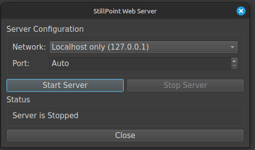
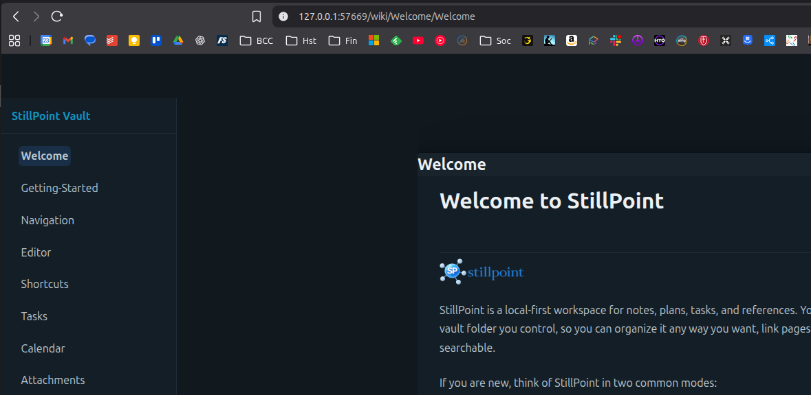

# Web Server
Created Tuesday 17 February 2026
---

StillPoint can share your vault as a simple website so you can read your notes in any browser. This is useful when you want a clean reading view, print to PDF, or quickly open your vault on another device on your network.

## What It Does
- Serves your vault pages in a browser view.
- Shows a left-side navigation tree and page content on the right.
- Renders page content, links, and attachments (including pasted images).
- Supports Print View and Print/PDF from the page header.

## Host Options
When you start the web server, choose one of these bind modes:

1. `Localhost only (127.0.0.1)`
- Only your current computer can open the site.
- Best for private local use.

2. `Local Network (0.0.0.0)`
- Other devices on your LAN can open the site.
- Good for viewing your vault on a phone/tablet or sharing internally.
- Use this only on trusted networks.

## Quick Start
1. Open the Web Server panel in StillPoint.
2. Choose your host mode.
3. Start the server.
4. Open the shown URL in your browser.
5. Browse folders/pages from the left navigation tree.

## Printing And PDFs
- Use **Print View** for a cleaner print layout.
- Use **Print/PDF** to open your browser print dialog and save as PDF.

## Notes On Safety
- `127.0.0.1` is local-only and safest for everyday use.
- `0.0.0.0` exposes the server to your local network.
- Avoid using local-network mode on public or untrusted Wi-Fi.

## Troubleshooting
- If the page does not load, confirm the server is running and check the URL/port.
- If another device cannot connect in local-network mode, check firewall/router rules.
- If content looks stale, refresh the browser page.

{width=900}
